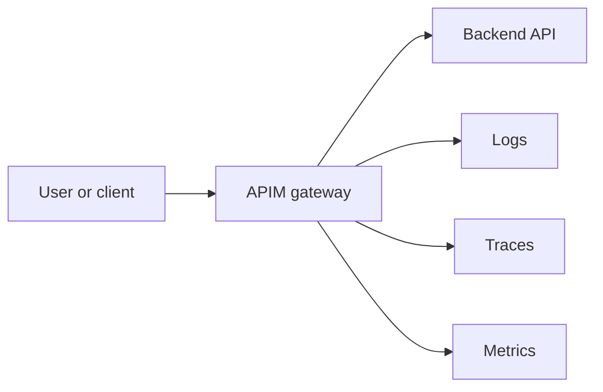

# First Day APIM Checklist

Use this if you are joining a project that uses APIs and Azure API Management
and you need a practical first day, not a theory course.

## Goal

After following this checklist, you will:

- know where the backend API is
- know where APIM sits in front of it
- be able to call the API through APIM
- be able to tell the difference between subscription auth and JWT auth
- be able to prove the route works with at least two tools
- be able to find logs, traces, and metrics for a real request

## 1. Learn The Shape Of The System

Use this as the system model:



## 2. Run The Fastest Full Stack

Start here:

```bash
make up-todo-otel
make smoke-todo
make verify-todo-otel
```

Open:

- `http://localhost:3000`
- [https://lgtm.apim.127.0.0.1.sslip.io:8443/d/apim-simulator-overview/apim-simulator-overview](https://lgtm.apim.127.0.0.1.sslip.io:8443/d/apim-simulator-overview/apim-simulator-overview)

What good looks like:

- the todo UI loads
- the UI shows `Connected via APIM`
- you can create a todo
- you can toggle a todo complete
- the Grafana dashboard loads

## 3. Prove The Browser Is Not Skipping APIM

In the todo UI, look for:

- browser API calls against `http://localhost:8000/api/...`
- the policy indicator
- correlation IDs in the call transcript

If the browser is calling the backend directly, the gateway is not the active
entrypoint.

## 4. Check Subscription Auth

Run these three requests:

Success:

```bash
curl \
  -H "Ocp-Apim-Subscription-Key: todo-demo-key" \
  http://localhost:8000/api/health
```

Missing key:

```bash
curl http://localhost:8000/api/todos
```

Invalid key:

```bash
curl \
  -H "Ocp-Apim-Subscription-Key: todo-demo-key-invalid" \
  http://localhost:8000/api/todos
```

Expected results:

- success returns `200`
- missing key returns `401`
- invalid key returns `401`

Interpretation:

- subscription keys control access to a product
- they do not represent a user identity

## 5. Check JWT Auth

Bring up the OIDC example:

```bash
make up-oidc
make smoke-oidc
```

Get a user token:

```bash
TOKEN=$(uv run --project . python scripts/get_keycloak_token.py)
```

Call the normal route:

```bash
curl \
  -H "Authorization: Bearer $TOKEN" \
  -H "Ocp-Apim-Subscription-Key: oidc-demo-key" \
  http://localhost:8000/api/echo
```

Then call the admin route with the same token:

```bash
curl \
  -H "Authorization: Bearer $TOKEN" \
  -H "Ocp-Apim-Subscription-Key: oidc-demo-key" \
  http://localhost:8000/admin/api/echo
```

Interpretation:

- the bearer token is identity
- the subscription key is product access
- both can be required at once
- `403` can mean authz failure, not route failure

## 6. Start With Two Fast Debug Tools

Use these first:

### `curl`

Best for:

- fast route checks
- auth header checks
- repeatable examples in docs and PRs

### Grafana

Best for:

- "did the system see my request?"
- "do I have logs, traces, and metrics?"
- "can I compare gateway and backend behaviour?"

If you need deeper inspection after that, move to:

- Bruno for saved request collections
- Proxyman for browser and HAR inspection
- `/apim/trace/{id}` for APIM-specific per-request trace detail

## 7. Learn Where The Important Files Live

If someone says "change the API", start with:

- Smallest starter backend: [`examples/hello-api/main.py`](../examples/hello-api/main.py)
- Smallest starter APIM config: [`examples/hello-api/apim.anonymous.json`](../examples/hello-api/apim.anonymous.json)
- Smallest starter compose overlay: [`compose.hello.yml`](../compose.hello.yml)
- Backend example: [`examples/todo-app/api-fastapi-container-app/main.py`](../examples/todo-app/api-fastapi-container-app/main.py)
- Gateway config for todo: [`examples/todo-app/apim.json`](../examples/todo-app/apim.json)
- JWT example config: [`examples/oidc/keycloak.json`](../examples/oidc/keycloak.json)
- Shared OTEL setup: [`app/telemetry.py`](../app/telemetry.py)
- Gateway runtime: [`app/main.py`](../app/main.py)
- Todo UI: [`examples/todo-app/frontend-astro/`](../examples/todo-app/frontend-astro/)

## 8. Ask These Questions Before You Change A Route

1. What does the backend route do?
2. What public path should APIM expose?
3. Is auth subscription-based, JWT-based, or both?
4. What should failure look like for missing auth?
5. How will a teammate prove the route works?
6. How will a teammate observe it in logs, traces, and metrics?

If those answers are unclear, resolve them before changing the route.

## 9. Minimum Definition Of Done

For a new API route, aim for all of these:

- one successful call through APIM
- one negative auth case
- one repeatable smoke or collection-based check
- one observable signal path in Grafana
- one short doc snippet explaining how to use the route

## 10. Read Next

- Main guided learning path: [`APIM-TRAINING-GUIDE.md`](./APIM-TRAINING-GUIDE.md)
- Azure vocabulary translation: [`AZURE-APIM-TERM-MAP.md`](./AZURE-APIM-TERM-MAP.md)
- Copy-paste service template: [`APIM-STARTER-RECIPE.md`](./APIM-STARTER-RECIPE.md)
