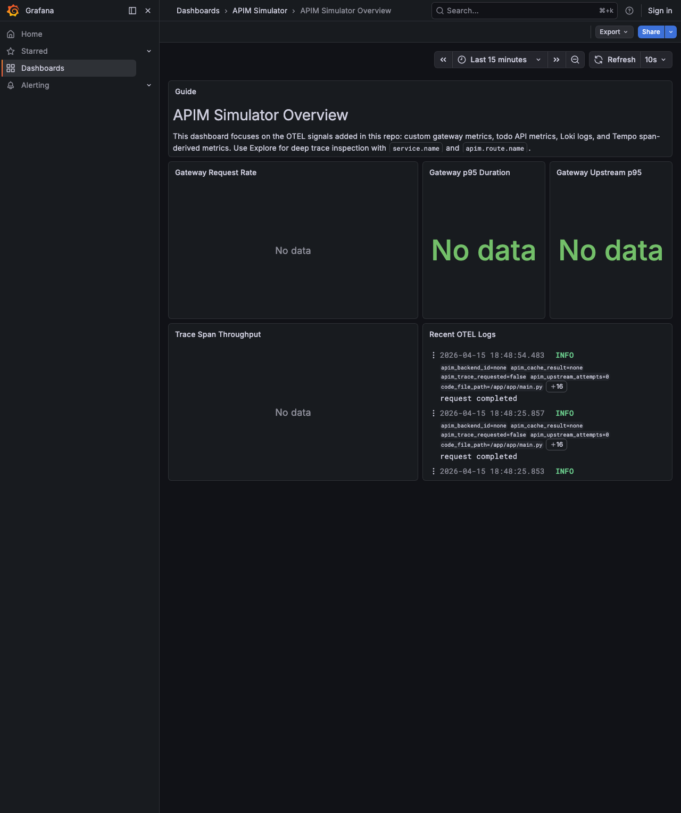

# APIM Simulator Walkthrough: Direct Public Gateway With OTEL

Generated from a live run against the local repository.

docker compose  -f compose.yml -f compose.public.yml -f compose.otel.yml up --build -d
#1 [internal] load local bake definitions
#1 reading from stdin 1.50kB done
#1 DONE 0.0s

#2 [mock-backend internal] load build definition from Dockerfile
#2 transferring dockerfile: 378B done
#2 DONE 0.0s

#3 [apim-simulator internal] load build definition from Dockerfile
#3 transferring dockerfile: 969B done
#3 DONE 0.0s

#4 [mock-backend internal] load metadata for dhi.io/python:3.13-debian13
#4 DONE 0.0s

#5 [mock-backend internal] load .dockerignore
#5 transferring context: 2B done
#5 DONE 0.0s

#6 [mock-backend internal] load build context
#6 transferring context: 31B done
#6 DONE 0.0s

#7 [mock-backend 1/3] FROM dhi.io/python:3.13-debian13@sha256:0131b9aa4400da8e0ef4eb110f3dba12c2a3c9b144a2eb831774557b9aceeac6
#7 resolve dhi.io/python:3.13-debian13@sha256:0131b9aa4400da8e0ef4eb110f3dba12c2a3c9b144a2eb831774557b9aceeac6 0.0s done
#7 DONE 0.0s

#8 [mock-backend 2/3] WORKDIR /app
#8 CACHED

#9 [mock-backend 3/3] COPY --chown=65532:65532 server.py .
#9 CACHED

#10 [mock-backend] exporting to image
#10 exporting layers done
#10 exporting manifest sha256:2daa54078fdfac5cdc9d1302b88f2bf4c018ba4f25ca487e9f407057eb403fde done
#10 exporting config sha256:b6e62c939de73bb190b7b854e63fd657d3dc689b0b741b670f35a6b5a162ec1f done
#10 exporting attestation manifest sha256:6ed0b431f9db1a9211403416705cc267db359bdb1afb9a59a5a2e8ecda45ce76 done
#10 exporting manifest list sha256:7c342a9347b4bab05914dda9faaa7537c064fe129ce10ecf54aa09240ddcd718 done
#10 naming to docker.io/library/apim-simulator-mock-backend:latest done
#10 unpacking to docker.io/library/apim-simulator-mock-backend:latest done
#10 DONE 0.1s

#11 [apim-simulator] resolve image config for docker-image://docker.io/docker/dockerfile:1.7
#11 ...

#12 [mock-backend] resolving provenance for metadata file
#12 DONE 0.0s

#11 [apim-simulator] resolve image config for docker-image://docker.io/docker/dockerfile:1.7
#11 DONE 0.4s

#13 [apim-simulator] docker-image://docker.io/docker/dockerfile:1.7@sha256:a57df69d0ea827fb7266491f2813635de6f17269be881f696fbfdf2d83dda33e
#13 resolve docker.io/docker/dockerfile:1.7@sha256:a57df69d0ea827fb7266491f2813635de6f17269be881f696fbfdf2d83dda33e 0.0s done
#13 CACHED

#14 [apim-simulator internal] load metadata for dhi.io/python:3.13-debian13-dev
#14 ...

#15 [apim-simulator internal] load metadata for ghcr.io/astral-sh/uv:0.10.4
#15 DONE 0.3s

#4 [apim-simulator internal] load metadata for dhi.io/python:3.13-debian13
#4 ...

#14 [apim-simulator internal] load metadata for dhi.io/python:3.13-debian13-dev
#14 DONE 0.5s

#4 [apim-simulator internal] load metadata for dhi.io/python:3.13-debian13
#4 DONE 0.5s

#16 [apim-simulator internal] load .dockerignore
#16 transferring context: 204B done
#16 DONE 0.0s

#17 [apim-simulator internal] load build context
#17 transferring context: 6.17kB 0.0s done
#17 DONE 0.0s

#18 [apim-simulator] FROM ghcr.io/astral-sh/uv:0.10.4@sha256:4cac394b6b72846f8a85a7a0e577c6d61d4e17fe2ccee65d9451a8b3c9efb4ac
#18 resolve ghcr.io/astral-sh/uv:0.10.4@sha256:4cac394b6b72846f8a85a7a0e577c6d61d4e17fe2ccee65d9451a8b3c9efb4ac 0.0s done
#18 DONE 0.0s

#19 [apim-simulator stage-1 1/5] FROM dhi.io/python:3.13-debian13@sha256:cb9222e6852d4017973551e444ee5e4af8e601e462415b12c80e7bfecb6efc45
#19 resolve dhi.io/python:3.13-debian13@sha256:cb9222e6852d4017973551e444ee5e4af8e601e462415b12c80e7bfecb6efc45 0.0s done
#19 DONE 0.0s

#20 [apim-simulator builder 1/5] FROM dhi.io/python:3.13-debian13-dev@sha256:845321bee112dc8c2220dfaecc5204096bd8f8ab349a7d8bb862693751aa0e2d
#20 resolve dhi.io/python:3.13-debian13-dev@sha256:845321bee112dc8c2220dfaecc5204096bd8f8ab349a7d8bb862693751aa0e2d 0.0s done
#20 DONE 0.0s

#21 [apim-simulator builder 2/5] WORKDIR /app
#21 CACHED

#22 [apim-simulator stage-1 3/5] COPY --chown=65532:65532 --from=builder /app/.venv /app/.venv
#22 CACHED

#23 [apim-simulator builder 3/5] COPY --from=ghcr.io/astral-sh/uv:0.10.4 /uv /usr/local/bin/uv
#23 CACHED

#24 [apim-simulator builder 5/5] RUN --mount=type=cache,target=/root/.cache/uv     uv sync --frozen --no-dev --no-install-project
#24 CACHED

#25 [apim-simulator builder 4/5] COPY pyproject.toml uv.lock ./
#25 CACHED

#26 [apim-simulator stage-1 4/5] COPY --chown=65532:65532 app ./app
#26 CACHED

#27 [apim-simulator stage-1 2/5] WORKDIR /app
#27 CACHED

#28 [apim-simulator stage-1 5/5] COPY --chown=65532:65532 examples ./examples
#28 CACHED

#29 [apim-simulator] exporting to image
#29 exporting layers done
#29 exporting manifest sha256:a377e9dcf5d19f2f79fdbce233768c87ce524c93323e89fbc0ed602f4fcb938d done
#29 exporting config sha256:a3183a2b1a2121ff39b719dd087dc4d05c6ef26a8950dd869b06d22acabdb07f done
#29 exporting attestation manifest sha256:07c788aba76f3451a3c391abed284d143a662bab56c243c2a7590942ee0f2156 0.0s done
#29 exporting manifest list sha256:84aa9325abd8a0a1a86d0bf52dee733de4829aa231af9f6c8143e1b2e236c5ce done
#29 naming to docker.io/library/apim-simulator:latest done
#29 unpacking to docker.io/library/apim-simulator:latest done
#29 DONE 0.1s

#30 [apim-simulator] resolving provenance for metadata file
#30 DONE 0.0s adds the LGTM stack on [https://lgtm.apim.127.0.0.1.sslip.io:8443](https://lgtm.apim.127.0.0.1.sslip.io:8443) so APIM traffic is visible in Grafana, Loki, Tempo, and Prometheus.

```bash
set -euo pipefail
make down >/dev/null 2>&1 || true
log="$(mktemp)"
make up-otel >"$log" 2>&1 || { cat "$log"; exit 1; }
for _ in $(seq 1 90); do
  curl -fsS http://localhost:8000/apim/health >/dev/null 2>&1 && curl -fsS "$GRAFANA_BASE_URL/api/health" >/dev/null 2>&1 && break
  sleep 1
done
docker compose -f compose.yml -f compose.public.yml -f compose.otel.yml ps --format json | jq -sS .
rm -f "$log"

```

```output
[
  {
    "Command": "\"/app/.venv/bin/pyth…\"",
    "CreatedAt": "2026-04-15 18:48:16 +0100 BST",
    "ExitCode": 0,
    "Health": "",
    "ID": "11546f84b70b",
    "Image": "apim-simulator:latest",
    "Labels": "com.docker.compose.image=sha256:5b7f91253dd00f21741b7e1ec644d8ea23d3c887598a39238e5916d8e29ed1aa,com.docker.compose.oneoff=False,com.docker.compose.version=5.1.1,com.docker.dhi.chain-id=sha256:b9e7c6e6bf9a389eaa805f1244eea298c7ecd133127518ede00ede39add3df83,com.docker.dhi.date.end-of-life=2029-10-31,com.docker.dhi.date.release=2024-10-07,com.docker.dhi.definition=image/python/debian-13/3.13,com.docker.compose.config-hash=b389fb38dd27453fa599cc64aa7e56ce183c6f4b512195894289acdaf05e9504,com.docker.compose.project.config_files=./compose.yml,./compose.public.yml,./compose.otel.yml,com.docker.compose.service=apim-simulator,com.docker.dhi.compliance=cis,com.docker.dhi.name=dhi/python,com.docker.dhi.shell=,com.docker.dhi.url=https://dhi.io/catalog/python,com.docker.dhi.variant=runtime,com.docker.compose.container-number=1,com.docker.compose.project.working_dir=.,com.docker.dhi.distro=debian-13,com.docker.dhi.entitlement=public,com.docker.dhi.flavor=,com.docker.dhi.version=3.13.13-debian13,com.docker.compose.depends_on=mock-backend:service_started:false,lgtm:service_started:false,com.docker.compose.project=apim-simulator,com.docker.dhi.created=2026-04-11T22:45:39Z,com.docker.dhi.package-manager=,com.docker.dhi.title=Python 3.13.x,desktop.docker.io/ports.scheme=v2,desktop.docker.io/ports/8000/tcp=:8000",
    "LocalVolumes": "0",
    "Mounts": "",
    "Name": "apim-simulator-apim-simulator-1",
    "Names": "apim-simulator-apim-simulator-1",
    "Networks": "apim-simulator_apim",
    "Ports": "0.0.0.0:8000->8000/tcp, [::]:8000->8000/tcp",
    "Project": "apim-simulator",
    "Publishers": [
      {
        "Protocol": "tcp",
        "PublishedPort": 8000,
        "TargetPort": 8000,
        "URL": "0.0.0.0"
      },
      {
        "Protocol": "tcp",
        "PublishedPort": 8000,
        "TargetPort": 8000,
        "URL": "::"
      }
    ],
    "RunningFor": "8 seconds ago",
    "Service": "apim-simulator",
    "Size": "0B",
    "State": "running",
    "Status": "Up 7 seconds"
  },
  {
    "Command": "\"/otel-lgtm/run-all.…\"",
    "CreatedAt": "2026-04-15 18:48:16 +0100 BST",
    "ExitCode": 0,
    "Health": "starting",
    "ID": "9f35ee9370d3",
    "Image": "grafana/otel-lgtm:0.24.0@sha256:a7fbde2893d86ae4807701bc482736243e584eb90b5faa273d291ffff2a1374f",
    "Labels": "com.docker.compose.version=5.1.1,com.redhat.license_terms=https://www.redhat.com/en/about/red-hat-end-user-license-agreements#UBI,desktop.docker.io/binds/1/Source=./observability/grafana/provisioning/dashboards/apim-simulator.yaml,maintainer=Grafana Labs,org.opencontainers.image.ref.name=v0.24.0,org.opencontainers.image.source=https://github.com/grafana/docker-otel-lgtm,release=,vcs-type=git,com.docker.compose.image=sha256:a7fbde2893d86ae4807701bc482736243e584eb90b5faa273d291ffff2a1374f,com.docker.compose.oneoff=False,desktop.docker.io/binds/1/SourceKind=hostFile,desktop.docker.io/binds/2/Target=/otel-lgtm/custom-dashboards,org.opencontainers.image.description=OpenTelemetry backend in a Docker image,org.opencontainers.image.documentation=https://github.com/grafana/docker-otel-lgtm/blob/main/README.md,org.opencontainers.image.vendor=Grafana Labs,build-date=,com.docker.compose.depends_on=,distribution-scope=public,io.buildah.version=,name=grafana/otel-lgtm,vcs-ref=7ac6a7cf03434cc414b5f1228c63b52069cf0f65,com.docker.compose.project.working_dir=.,desktop.docker.io/binds/2/Source=./observability/grafana/dashboards,desktop.docker.io/binds/2/SourceKind=hostFile,io.k8s.display-name=Grafana LGTM,io.openshift.expose-services=,org.opencontainers.image.authors=Grafana Labs,org.opencontainers.image.revision=7ac6a7cf03434cc414b5f1228c63b52069cf0f65,org.opencontainers.image.title=docker-otel-lgtm,com.docker.compose.project=apim-simulator,cpe=,desktop.docker.io/ports/4317/tcp=:4317,desktop.docker.io/ports/4318/tcp=:4318,org.opencontainers.image.licenses=Apache-2.0,summary=An OpenTelemetry backend in a Docker image,com.docker.compose.config-hash=9759eb97aaa5b2755de94820d28d5695a2b75ee9b22bde59eac0493dcf585f1c,com.redhat.component=ubi9-micro-container,desktop.docker.io/binds/1/Target=/otel-lgtm/grafana/conf/provisioning/dashboards/apim-simulator.yaml,io.k8s.description=An open source backend for OpenTelemetry that's intended for development, demo, and testing environments.,org.opencontainers.image.created=2026-04-10T09:33:00.461Z,org.opencontainers.image.version=0.24.0,com.docker.compose.container-number=1,desktop.docker.io/ports.scheme=v2,url=https://github.com/grafana/docker-otel-lgtm,architecture=aarch64,com.docker.compose.project.config_files=./compose.yml,./compose.public.yml,./compose.otel.yml,com.docker.compose.service=lgtm,description=An open source backend for OpenTelemetry that's intended for development, demo, and testing environments.,org.opencontainers.image.url=https://github.com/grafana/docker-otel-lgtm,vendor=Grafana Labs,version=v0.24.0",
    "LocalVolumes": "1",
    "Mounts": "apim-simulator…,/host_mnt/User…,/host_mnt/User…",
    "Name": "apim-simulator-lgtm-1",
    "Names": "apim-simulator-lgtm-1",
    "Networks": "apim-simulator_apim",
    "Ports": "0.0.0.0:4317-4318->4317-4318/tcp, [::]:4317-4318->4317-4318/tcp",
    "Project": "apim-simulator",
    "Publishers": [
      {
        "Protocol": "tcp",
        "PublishedPort": 4317,
        "TargetPort": 4317,
        "URL": "0.0.0.0"
      },
      {
        "Protocol": "tcp",
        "PublishedPort": 4317,
        "TargetPort": 4317,
        "URL": "::"
      },
      {
        "Protocol": "tcp",
        "PublishedPort": 4318,
        "TargetPort": 4318,
        "URL": "0.0.0.0"
      },
      {
        "Protocol": "tcp",
        "PublishedPort": 4318,
        "TargetPort": 4318,
        "URL": "::"
      }
    ],
    "RunningFor": "8 seconds ago",
    "Service": "lgtm",
    "Size": "0B",
    "State": "running",
    "Status": "Up 7 seconds (health: starting)"
  },
  {
    "Command": "\"nginx -g 'daemon of…\"",
    "CreatedAt": "2026-04-15 18:48:16 +0100 BST",
    "ExitCode": 0,
    "Health": "",
    "ID": "2ade30d9a7bc",
    "Image": "dhi.io/nginx:1.29.5-debian13",
    "Labels": "com.docker.compose.image=sha256:9683af47feae3bab0031b489ed85f93f340a0f8b83a2edccc9f761dbfce1bffd,com.docker.compose.oneoff=False,com.docker.compose.project=apim-simulator,com.docker.dhi.compliance=cis,com.docker.dhi.flavor=,com.docker.dhi.title=Nginx mainline,com.docker.dhi.variant=runtime,desktop.docker.io/binds/1/Target=/etc/nginx/nginx.conf,desktop.docker.io/ports.scheme=v2,com.docker.compose.version=5.1.1,com.docker.dhi.definition=image/nginx/debian-13/mainline,com.docker.dhi.name=dhi/nginx,com.docker.dhi.shell=,com.docker.dhi.version=1.29.5-debian13,com.docker.compose.config-hash=3edba5ad2ac9cfd6f4c060a20619a208e20d5ec2e9a3d2aae1578d1f7b06f423,com.docker.compose.project.config_files=./compose.yml,./compose.public.yml,./compose.otel.yml,desktop.docker.io/binds/0/Target=/etc/nginx/certs,com.docker.compose.container-number=1,com.docker.compose.service=lgtm-proxy,com.docker.dhi.created=2026-02-05T05:17:44Z,com.docker.dhi.url=https://dhi.io/catalog/nginx,desktop.docker.io/binds/0/Source=./examples/edge/certs,desktop.docker.io/binds/1/Source=./observability/lgtm/nginx.conf,desktop.docker.io/binds/1/SourceKind=hostFile,com.docker.dhi.chain-id=sha256:12d6f6bfdcac60cd53148007d8b5ee2c5a827f82ad0a8568232264eb95b6f5e2,com.docker.dhi.distro=debian-13,com.docker.compose.depends_on=lgtm:service_started:false,com.docker.dhi.date.release=2025-06-24,desktop.docker.io/binds/0/SourceKind=hostFile,com.docker.compose.project.working_dir=.,com.docker.dhi.package-manager=,desktop.docker.io/ports/8443/tcp=:8443",
    "LocalVolumes": "0",
    "Mounts": "/host_mnt/User…,/host_mnt/User…",
    "Name": "apim-simulator-lgtm-proxy-1",
    "Names": "apim-simulator-lgtm-proxy-1",
    "Networks": "apim-simulator_apim",
    "Ports": "0.0.0.0:8443->8443/tcp, [::]:8443->8443/tcp",
    "Project": "apim-simulator",
    "Publishers": [
      {
        "Protocol": "tcp",
        "PublishedPort": 8443,
        "TargetPort": 8443,
        "URL": "0.0.0.0"
      },
      {
        "Protocol": "tcp",
        "PublishedPort": 8443,
        "TargetPort": 8443,
        "URL": "::"
      }
    ],
    "RunningFor": "8 seconds ago",
    "Service": "lgtm-proxy",
    "Size": "0B",
    "State": "running",
    "Status": "Up 7 seconds"
  },
  {
    "Command": "\"python server.py\"",
    "CreatedAt": "2026-04-15 18:48:16 +0100 BST",
    "ExitCode": 0,
    "Health": "",
    "ID": "c910e8ce877b",
    "Image": "apim-simulator-mock-backend:latest",
    "Labels": "com.docker.dhi.chain-id=sha256:e68172a1b009e121980466426bb3c0b7a6184cc9d5a4200b57ee2dc4292779da,com.docker.dhi.created=2026-04-08T03:14:50Z,com.docker.dhi.entitlement=public,com.docker.dhi.flavor=,com.docker.dhi.shell=,com.docker.dhi.version=3.13.12-debian13,com.docker.compose.container-number=1,com.docker.compose.image=sha256:bc515ad39af9f2ed507bf60cc9b7063361eeba3a84d4bd3475f983d9a707eae5,com.docker.compose.project.config_files=./compose.yml,./compose.public.yml,./compose.otel.yml,com.docker.compose.project.working_dir=.,com.docker.compose.service=mock-backend,com.docker.dhi.date.release=2024-10-07,com.docker.dhi.definition=image/python/debian-13/3.13,com.docker.dhi.url=https://dhi.io/catalog/python,com.docker.compose.project=apim-simulator,com.docker.dhi.date.end-of-life=2029-10-31,com.docker.dhi.title=Python 3.13.x,desktop.docker.io/ports.scheme=v2,com.docker.dhi.compliance=cis,com.docker.compose.depends_on=,com.docker.compose.oneoff=False,com.docker.compose.version=5.1.1,com.docker.dhi.distro=debian-13,com.docker.dhi.name=dhi/python,com.docker.dhi.package-manager=,com.docker.dhi.variant=runtime,com.docker.compose.config-hash=815e10da41b3af6176108902ed23ffc47edfaf9c27a33e160094fa0330e92164",
    "LocalVolumes": "0",
    "Mounts": "",
    "Name": "apim-simulator-mock-backend-1",
    "Names": "apim-simulator-mock-backend-1",
    "Networks": "apim-simulator_apim",
    "Ports": "8080/tcp",
    "Project": "apim-simulator",
    "Publishers": [
      {
        "Protocol": "tcp",
        "PublishedPort": 0,
        "TargetPort": 8080,
        "URL": ""
      }
    ],
    "RunningFor": "8 seconds ago",
    "Service": "mock-backend",
    "Size": "0B",
    "State": "running",
    "Status": "Up 7 seconds"
  }
]
```

```bash
set -euo pipefail
verify_log="$(mktemp)"
make verify-otel >"$verify_log" 2>&1 || { cat "$verify_log"; exit 1; }
apim_health="$(curl -fsS http://localhost:8000/apim/health)"
grafana_health="$(curl -fsS "$GRAFANA_BASE_URL/api/health")"
jq -n \
  --argjson apim_health "$apim_health" \
  --argjson grafana_health "$grafana_health" \
  --arg verify_log "$(cat "$verify_log")" \
  '{
    apim_health: $apim_health,
    grafana_health: $grafana_health,
    verify_otel: "passed",
    verify_output: ($verify_log | split("\n") | map(select(length > 0)))
  }'
rm -f "$verify_log"

```

```output
{
  "apim_health": {
    "status": "healthy"
  },
  "grafana_health": {
    "database": "ok",
    "version": "12.4.2",
    "commit": "ebade4c739e1aface4ce094934ad85374887a680"
  },
  "verify_otel": "passed",
  "verify_output": [
    "uv run --project . python scripts/verify_otel.py",
    "Grafana healthy: version=12.4.2",
    "APIM metrics visible: 2 series",
    "Loki services: apim-simulator, hello-api",
    "Tempo services: apim-simulator",
    "otel verification passed"
  ]
}
```

```bash {image}
set -euo pipefail
rodney stop >/dev/null 2>&1 || true
rm -f "$HOME/.rodney/chrome-data/SingletonLock"
rodney start >/tmp/rodney-start.log 2>&1 || true
sleep 2
rodney open "$GRAFANA_BASE_URL/d/apim-simulator-overview/apim-simulator-overview" >/dev/null
rodney waitload >/dev/null
rodney waitstable >/dev/null
rodney sleep 2 >/dev/null
rodney screenshot walkthrough-core-grafana.png

```


