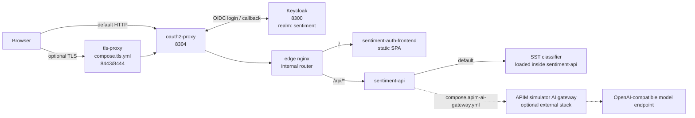
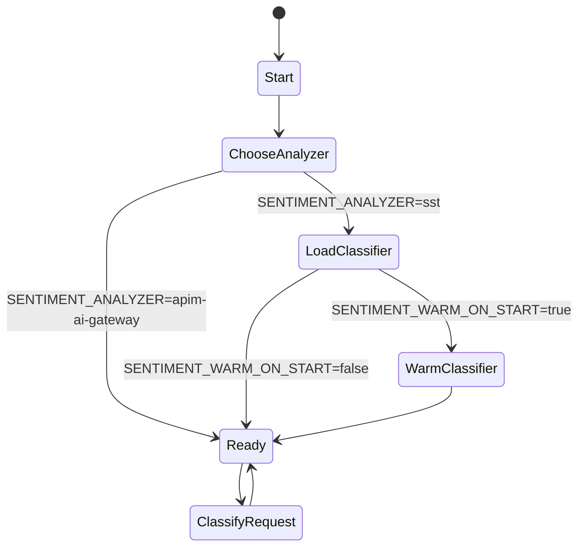
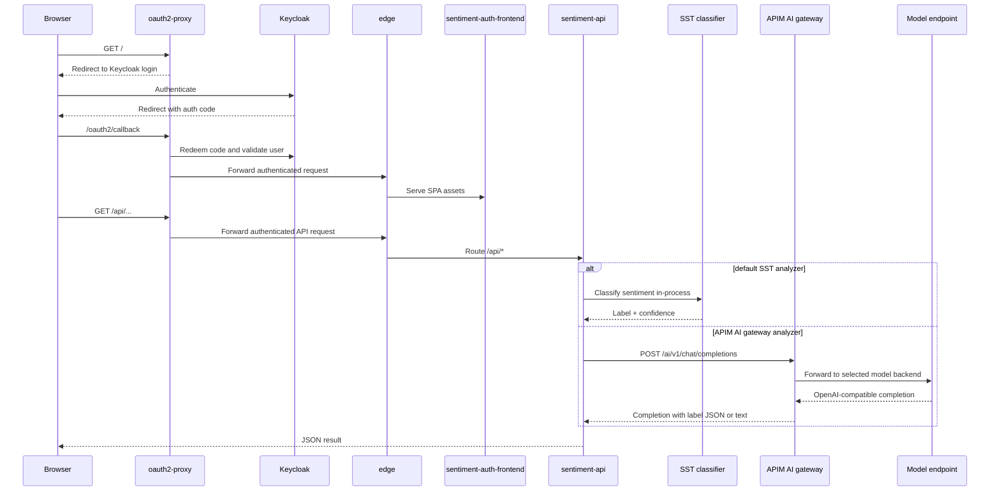
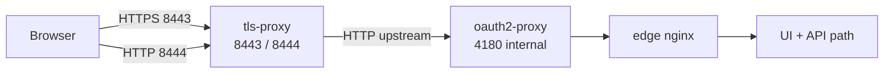

# Sentiment Compose Architecture

This document explains how `sentiment` works when run directly from the
compose files in this app directory, without Kubernetes or Terraform.

## Scope

- `compose.yml` is the primary local runtime.
- `compose.tls.yml` is a thin overlay that adds a TLS 1.3 front door.
- The default runtime path is `sentiment-api -> in-process SST classifier`.
- `compose.apim-ai-gateway.yml` switches inference to
  `sentiment-api -> APIM simulator AI gateway -> OpenAI-compatible backend`.

## Compose Files

| File | Role |
| --- | --- |
| [`compose.yml`](../compose.yml) | Main authenticated local stack: Keycloak, oauth2-proxy, edge router, API, UI, and SST inference. |
| [`compose.tls.yml`](../compose.tls.yml) | Optional TLS 1.3 overlay in front of `oauth2-proxy`. |
| [`compose.apim-ai-gateway.yml`](../compose.apim-ai-gateway.yml) | Optional overlay that disables SST preload and points `sentiment-api` at the APIM simulator AI gateway. |

## System Context

## Runtime Slices

- `oauth2-proxy` is the browser-facing gate. It handles login and cookie
  management, then forwards all authenticated traffic upstream.
- `edge` is the internal application router. It sends `/api/*` to
  `sentiment-api` and everything else to the static UI.
- `sentiment-api` owns inference routing. The browser never chooses the model
  path.
- `POST /api/v1/comments` analyzes and persists a comment. `POST
  /api/v1/sentiment/classify` uses the same analyzer but returns only the
  classification result, so machine clients such as Platform MCP can inspect
  sentiment without changing comment history.
- The default local setup is fully self-contained inside `sentiment-api`.
- The APIM AI gateway overlay keeps the API and UI unchanged but moves
  inference behind APIM-style backend selection, token limits, and fallback.

## Backend State Diagram

## Authenticated Request Journey

## TLS Overlay

## Request Ownership Cheatsheet

| Hop | Owner in compose runtime | Why it exists |
| --- | --- | --- |
| Browser -> `oauth2-proxy` | OIDC front door | Forces login before the app is reachable. |
| `oauth2-proxy` -> `keycloak` | Identity provider | Handles the local OIDC flow. |
| `oauth2-proxy` -> `edge` | Authenticated upstream | Keeps auth separate from the app router. |
| `edge` -> `sentiment-auth-frontend` | UI split | Static assets and API stay separate. |
| `edge` -> `sentiment-api` | API split | `/api/*` stays on the backend path. |
| `sentiment-api` -> in-process SST classifier | Default inference path | Fully local and self-contained. |
| `sentiment-api` -> APIM simulator AI gateway | Optional inference path | Uses APIM-style routing in front of local or external OpenAI-compatible model endpoints. |

## Practical Reading Guide

- Use the system context diagram when you want to know which containers matter.
- Use the state diagram when you want to know when the SST classifier is loaded.
- Use the sequence diagram when debugging auth, routing, or upstream latency.
