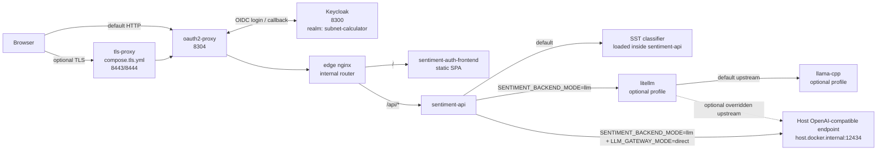
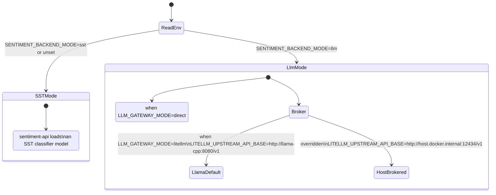
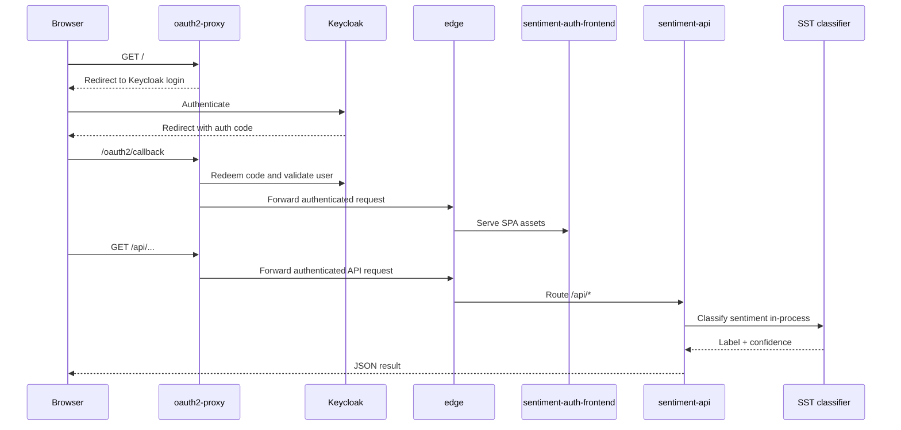
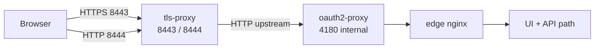

# Sentiment Compose Architecture

This document explains how `sentiment` works when run directly from the
compose files in this app directory, without Kubernetes or Terraform.

## Scope

- `compose.yml` is the primary local runtime.
- `compose.tls.yml` is a thin overlay that adds a TLS 1.3 front door.
- The default path is `sentiment-api -> in-process SST classifier`.
- A legacy LLM path is still supported through compose profiles and
  environment overrides.

## Compose Files

| File | Role |
| --- | --- |
| [`compose.yml`](../compose.yml) | Main authenticated local stack: Keycloak, oauth2-proxy, edge router, API, UI, and model path. |
| [`compose.tls.yml`](../compose.tls.yml) | Optional TLS 1.3 overlay in front of `oauth2-proxy`. |

## Important Local Quirk

The local Keycloak realm asset still uses the realm name `subnet-calculator`.
That is not a typo in this document. It is the current checked-in compose
behavior in [`compose.yml`](../compose.yml) and
[`keycloak/realm-export.json`](../keycloak/realm-export.json).

## System Context

## Runtime Slices

- `oauth2-proxy` is the browser-facing gate. It handles login and cookie
  management, then forwards all authenticated traffic upstream.
- `edge` is the internal application router. It sends `/api/*` to
  `sentiment-api` and everything else to the static UI.
- `sentiment-api` owns the backend mode switch. The browser never chooses the
  model path directly.
- The default local setup is fully self-contained inside `sentiment-api`.
- `litellm` is a broker, not the model itself. In the optional LLM profile it
  forwards to `llama-cpp`, but it can also proxy to a host endpoint.

## Backend Mode State Diagram

## Authenticated Request Journey

## TLS Overlay

## Request Ownership Cheatsheet

| Hop | Owner in compose runtime | Why it exists |
| --- | --- | --- |
| Browser -> `oauth2-proxy` | OIDC front door | Forces login before the app is reachable. |
| `oauth2-proxy` -> `keycloak` | Identity provider | Handles the local OIDC flow. |
| `oauth2-proxy` -> `edge` | Authenticated upstream | Keeps auth separate from the app router. |
| `edge` -> `sentiment-auth-frontend` | UI split | Static assets and API stay separate. |
| `edge` -> `sentiment-api` | API split | `/api/*` stays on the backend path. |
| `sentiment-api` -> in-process SST classifier | Default inference path | Fully local and self-contained. |
| `sentiment-api` -> `litellm` -> `llama-cpp` | Optional LLM profile | Keeps the previous compose path available. |
| `sentiment-api` -> host LLM | Optional direct LLM mode | Useful when testing a host-backed model runner. |

## Practical Reading Guide

- Use the system context diagram when you want to know which containers matter.
- Use the state diagram when you want to know which sentiment backend is active.
- Use the sequence diagram when debugging auth, routing, or upstream latency.
