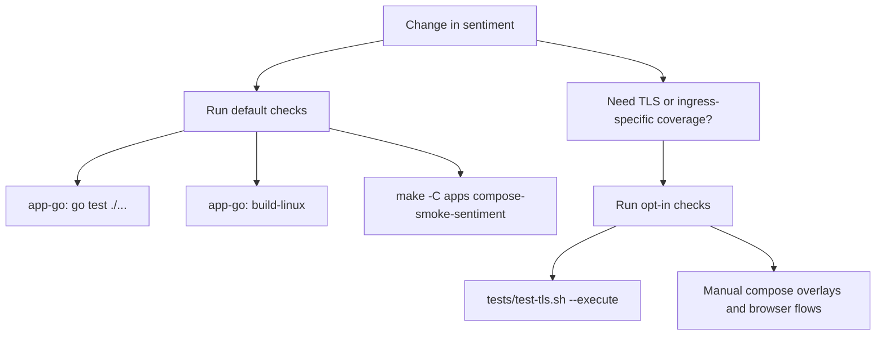

# Sentiment Test Runbook

This app has a small default verification path and a few heavier opt-in checks.

## Default Checks

- `make -C apps/sentiment/app-go test`
- `make -C apps compose-smoke-sentiment`
- `make -C apps/apim-simulator up-ai-gateway && make -C apps/sentiment smoke-apim-ai-gateway`

Use this path for normal application changes. It covers the API, the authenticated UI build, and the minimal compose wiring.

## Opt-In Checks

- `cd apps/sentiment && ./tests/test-tls.sh --execute`
- `cd apps/sentiment && docker compose -f compose.yml -f compose.tls.yml up`

Use the opt-in path when you change TLS, reverse-proxy behavior, or browser entry routing.
