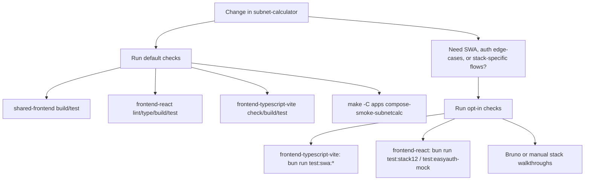

# Subnet Calculator Test Runbook

The default path keeps each frontend suite runnable in isolation. Environment-coupled stacks stay explicit.

## Default Checks

- `cd apps/subnet-calculator/shared-frontend && bun run lint:check && bun run type-check && bun run build && bun run test`
- `cd apps/subnet-calculator/frontend-react && bun run lint:check && bun run type-check && bun run build && bun run test`
- `cd apps/subnet-calculator/frontend-typescript-vite && bun run check && bun run build && bun run test`
- `make -C apps compose-smoke-subnetcalc`

This is the expected path for normal UI, config, and container work. The default `frontend-typescript-vite` Playwright config now excludes SWA-only specs, so it stays runnable against local preview without extra services.

## Opt-In Checks

- `cd apps/subnet-calculator/frontend-typescript-vite && bun run test:swa:stack4`
- `cd apps/subnet-calculator/frontend-typescript-vite && bun run test:swa:stack5`
- `cd apps/subnet-calculator/frontend-react && bun run test:stack12`
- `cd apps/subnet-calculator/frontend-react && bun run test:easyauth-mock`
- `make -C apps compose-smoke`

Use the opt-in path when you are changing SWA routing, OIDC/Easy Auth behavior, or stack-specific integrations that cannot be reproduced by the isolated default suites.
