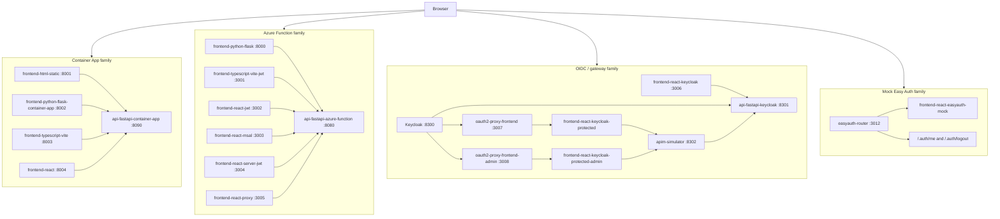
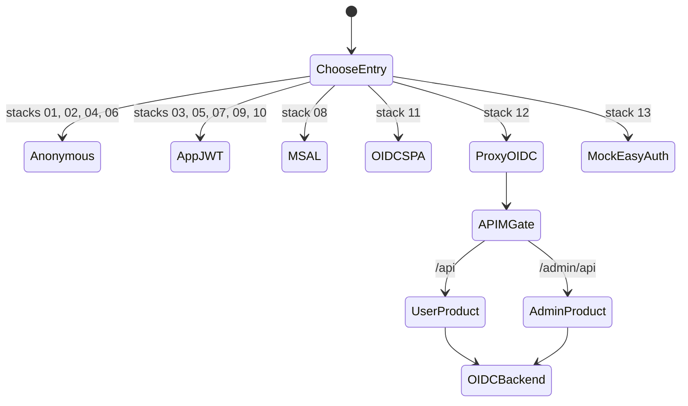
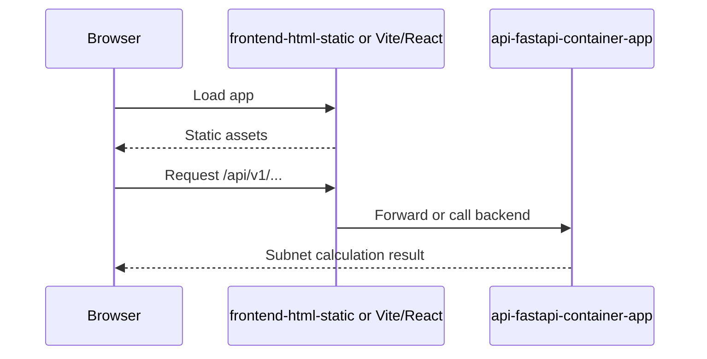
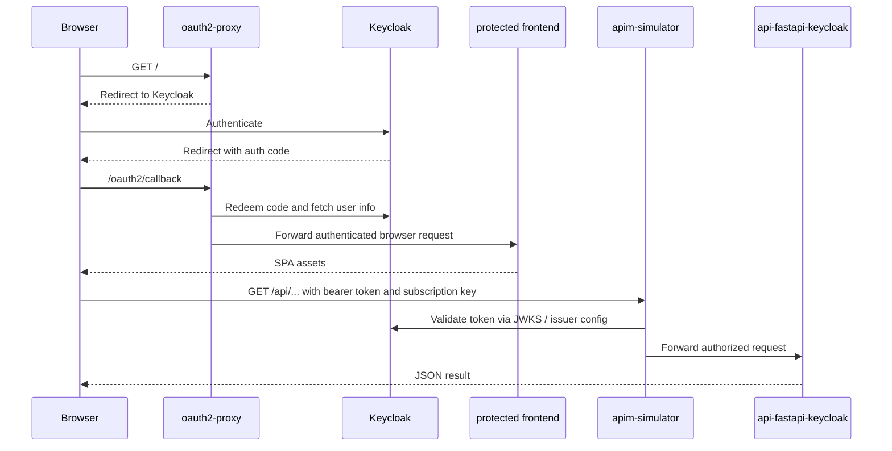
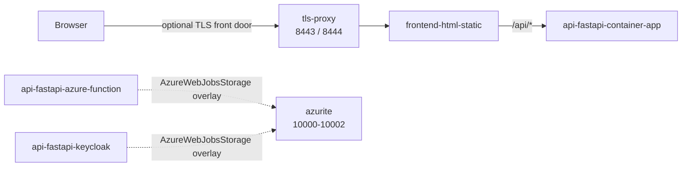

# Compose Architecture

This document explains how `subnetcalc` works when it is run directly
from the compose files in this app directory rather than through the
Kubernetes/Terraform platform stack.

## Scope

- [`compose.yml`](../compose.yml) is the main local topology and defines the
  numbered local stacks. By default it now starts only the baseline
  container-app family; the heavier function, OIDC, and mock Easy Auth families
  are opt-in via compose profiles.
- [`compose.tls.yml`](../compose.tls.yml) adds a TLS 1.3 front door in front of
  one compose slice.
- [`compose.azurite.yml`](../compose.azurite.yml) adds local Azure Storage
  emulation for the Function-style backends.
- The standalone `compose.yml` files under individual component directories are
  narrower entry points for working on one backend or frontend in isolation.

## Compose File Map

| File | Role |
| --- | --- |
| [`compose.yml`](../compose.yml) | Main local runtime. Default `compose up` starts the baseline container-app family; `function-family`, `oidc`, and `mock-easyauth` profiles opt into the heavier slices. |
| [`compose.tls.yml`](../compose.tls.yml) | Optional TLS 1.3 overlay, currently wired for the static frontend plus container-app API path. |
| [`compose.azurite.yml`](../compose.azurite.yml) | Optional Azurite overlay for the Function-based paths. |
| `*/compose.yml` | Narrow per-component stacks used for focused local work. |

## Stack Matrix

| Stack | Browser entry | Auth model | Main backend path |
| --- | --- | --- | --- |
| 01 | `frontend-html-static` on `:8001` | none | `frontend-html-static -> api-fastapi-container-app` |
| 02 | `frontend-python-flask-container-app` on `:8002` | none | `frontend-python-flask -> api-fastapi-container-app` |
| 03 | `frontend-python-flask` on `:8000` | JWT in app | `frontend-python-flask -> api-fastapi-azure-function` |
| 04 | `frontend-typescript-vite` on `:8003` | none | `frontend-typescript-vite -> api-fastapi-container-app` |
| 05 | `frontend-typescript-vite-jwt` on `:3001` | JWT in SPA | `frontend-typescript-vite-jwt -> api-fastapi-azure-function` |
| 06 | `frontend-react` on `:8004` | none | `frontend-react -> api-fastapi-container-app` |
| 07 | `frontend-react-jwt` on `:3002` | JWT in SPA | `frontend-react-jwt -> api-fastapi-azure-function` |
| 08 | `frontend-react-msal` on `:3003` | MSAL / Azure AD style | `frontend-react-msal -> api-fastapi-azure-function` |
| 09 | `frontend-react-server-jwt` on `:3004` | JWT with runtime config | `frontend-react-server-jwt -> api-fastapi-azure-function` |
| 10 | `frontend-react-proxy` on `:3005` | JWT plus frontend-side proxy | `frontend-react-proxy -> api-fastapi-azure-function` |
| 11 | `frontend-react-keycloak` on `:3006` | OIDC in SPA | `frontend-react-keycloak -> api-fastapi-keycloak` |
| 12 | `oauth2-proxy-frontend` on `:3007` and admin on `:3008` | OIDC at proxy front door | `oauth2-proxy -> protected frontend -> apim-simulator -> api-fastapi-keycloak` |
| 13 | `easyauth-router` on `:3012` | mocked Easy Auth | `easyauth-router -> frontend-react-easyauth-mock` |

## Local Stack Families

## Auth And Routing State Diagram

## Anonymous Container-App Journey

This is the simplest non-Kubernetes path and is the easiest place to reason
about the core application behavior.

## OIDC Plus APIM Journey

Stack 12 is the local compose topology that most closely mirrors the layered
gateway pattern used in the platform stack.

## Overlay Topology

## What The Compose Runtime Is Proving

- The same application logic can be exercised through several hosting and auth
  shapes without Kubernetes.
- Frontend choice, auth style, and backend style are intentionally mixed and
  matched rather than hidden behind one blessed local stack.
- Stack 12 is the closest compose analogue to the layered platform path:
  identity gate, frontend, API-management hop, then backend API.
