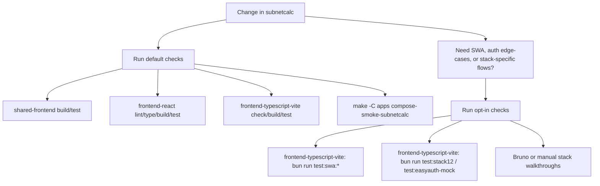

# Subnet Calculator Test Runbook

The default path keeps each frontend suite runnable in isolation. Environment-coupled stacks stay explicit.



## Default Checks

- `cd apps/subnetcalc/shared-frontend && bun run lint:check && bun run type-check && bun run build && bun run test`
- `cd apps/subnetcalc/frontend-react && bun run lint:check && bun run type-check && bun run build && bun run test`
- `cd apps/subnetcalc/frontend-typescript-vite && bun run check && bun run build && bun run test`
- `make -C apps/subnetcalc test-conformance SUBNETCALC_CONFORMANCE_BASE_URL=http://127.0.0.1:8090`
- `./scripts/check-repo-version.sh --execute`
- `make -C apps compose-smoke-subnetcalc`

This is the expected path for normal UI, config, and container work. The default `frontend-typescript-vite` Playwright config now excludes SWA-only specs, so it stays runnable against local preview without extra services.

## API Contract Conformance

The process-based API harness lives under `tests/conformance/` and can run
against any backend exposing the subnetcalc HTTP API. Use it when changing the
core subnet, provider range, or network planning contract:

```bash
make -C apps/subnetcalc test-conformance SUBNETCALC_CONFORMANCE_BASE_URL=http://127.0.0.1:8090
```

For JWT-protected backends, provide the test-user credentials so the same
contract cases run with a bearer token:

```bash
apps/subnetcalc/tests/conformance/subnetcalc_contract.py \
  --base-url http://127.0.0.1:8080 \
  --jwt-username demo@dev.test \
  --jwt-password demo-password
```

Coverage accounting: [`../tests/conformance/COVERAGE.md`](../tests/conformance/COVERAGE.md)
Known divergences: [`../tests/conformance/DISCREPANCIES.md`](../tests/conformance/DISCREPANCIES.md)

## Compose Matrix

`make -C apps/subnetcalc test` runs the current compose matrix and cleans up
all profile services when it exits:

- API conformance for Go, FastAPI container, and Azure Function backends in
  anonymous mode.
- API conformance for FastAPI container and Azure Function backends in JWT
  mode.
- Anonymous frontend/backend matrix:
  - Frontends: Go, static HTML, Flask, TypeScript Vite, React.
  - Backends: Go, FastAPI container, Azure Function.
- JWT-capable frontend/backend matrix:
  - Frontends: Flask, TypeScript Vite JWT, React JWT, React server JWT, React
    proxy JWT.
  - Backends: FastAPI container, Azure Function.
- JWT-protected negative checks for Go and static HTML frontends, which do not
  acquire JWTs yet. Their shell must load through the selected backend route,
  and protected API calls must return `401`.

The compose file now treats the backend route as runtime configuration. Frontend
services receive the API next-hop through `SUBNETCALC_FRONTEND_*` variables, and
the static nginx frontend renders `nginx.conf.template` at container startup so
the same image can target different backend containers.

Set `SUBNETCALC_COMPOSE_SKIP_BUILD=1` to run the same matrix against existing
local images. That mode is intended for prebuilt-image verification and for
rerunning matrix logic when Docker image resolution is not part of the change.

The remaining matrix gap is OIDC/Easy Auth browser coverage and token
acquisition for frontends that do not yet have a login flow. Those stay in the
opt-in SWA/Easy Auth checks until they can be exercised as deterministic compose
contracts.

## Opt-In Checks

- `cd apps/subnetcalc/frontend-typescript-vite && bun run test:swa:stack4`
- `cd apps/subnetcalc/frontend-typescript-vite && bun run test:swa:stack5`
- `cd apps/subnetcalc/frontend-typescript-vite && bun run test:stack12`
- `cd apps/subnetcalc/frontend-typescript-vite && bun run test:easyauth-mock`
- `make -C apps compose-smoke`

Use the opt-in path when you are changing SWA routing, OIDC/Easy Auth behavior, or stack-specific integrations that cannot be reproduced by the isolated default suites.
