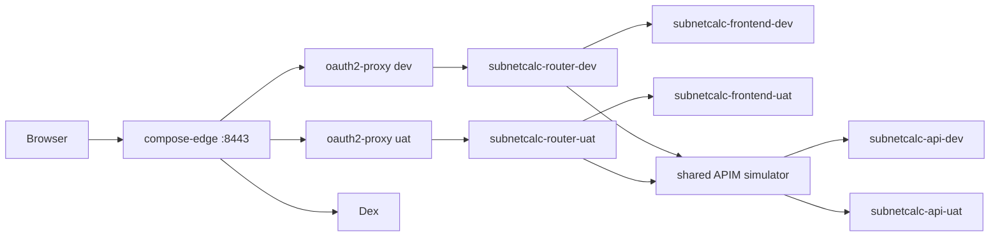

# compose

Repo-level Docker Compose experiment for the local platform.

This target stays smaller than [`../../kubernetes/kind`](../../kubernetes/kind/README.md), but it now follows the same two platform decisions that matter most:

- HTTPS at the shared edge
- Dex plus `oauth2-proxy` for browser-facing SSO

It still focuses on `subnetcalc`, because that app exercises the hard parts: environment split, auth gating, and the APIM hop.

## Why This Exists

The first Compose iteration proved the app path. This iteration narrows the gap with `kind`:



The useful comparison is not "can Compose replace Kubernetes?". It cannot. The useful comparison is "what is the smallest surface that still preserves the same app-serving and SSO ideas?" This target is trying to answer that.

## Parallel-Safe Default

`kind` usually owns `127.0.0.1:443`. Reusing the exact same hosts in Compose means:

- port collision with the running cluster
- browser HSTS state leaking between the two environments

So the Compose target now defaults to its own hostname namespace and TLS port:

- `subnetcalc.dev.compose.127.0.0.1.sslip.io:8443`
- `subnetcalc.uat.compose.127.0.0.1.sslip.io:8443`
- `dex.compose.127.0.0.1.sslip.io:8443`

That is the cleanest way to let `kind` and Compose exist in parallel without lying to the browser.
The separate `check-https-443-available` target exists so the repo can answer
"is bare `:443` free right now?" before Docker gets a chance to fail later.

## Quick Start

Before these compose targets, copy the repo root template and set
`OAUTH2_PROXY_COOKIE_SECRET`:

```bash
cp .env.example .env
```

The `make -C docker/compose ...` targets load that repo-root `.env`
automatically.

From the repo root:

```bash
make -C docker/compose prereqs
make -C docker/compose check-host-ports
make -C docker/compose up
make -C docker/compose urls
```

`up` will generate or refresh the mkcert-backed edge certificate automatically.
It also runs the host-port preflight first, so collisions fail before Docker
tries to bind them.

You can also start one environment at a time:

```bash
make -C docker/compose up-dev
make -C docker/compose up-uat
```

Tear it down with:

```bash
make -C docker/compose down
```

If you want to probe whether direct HTTPS on `:443` is available on the current
machine, check that explicitly first:

```bash
make -C docker/compose check-https-443-available
```

## Default URLs

- `DEV`: <https://subnetcalc.dev.compose.127.0.0.1.sslip.io:8443>
- `UAT`: <https://subnetcalc.uat.compose.127.0.0.1.sslip.io:8443>
- `Dex`: <https://dex.compose.127.0.0.1.sslip.io:8443/dex>
- `Dex debug`: <http://localhost:8300/dex/.well-known/openid-configuration>
- `APIM health`: <http://localhost:8302/apim/health>

There is also an HTTP redirect shim on `:8088` for the app hosts.

## Demo Credentials

- `demo@dev.test` / `password123`
- `demo@uat.test` / `password123`
- `demo@admin.test` / `password123`

## What This Topology Is Proving

### `subnet-dev` vs `subnet-uat`

The environment split is still mostly routing and session policy, not orchestration weight.

- `edge` routes `subnetcalc.dev.compose...` and `subnetcalc.uat.compose...` to different `oauth2-proxy` instances
- each environment has its own proxy cookie and upstream router
- the dev proxy only accepts `@dev.test`
- the uat proxy only accepts `@uat.test`
- the shared APIM picks the backend from `Host`

That is much cheaper than namespaces and CRDs, but it still preserves the main platform question: "what does environment isolation actually need to be?"

### HTTPS with mkcert

Compose does not need cert-manager to be useful here.

- the shared edge terminates TLS with a mkcert-generated certificate
- the browser sees trusted local HTTPS on the Compose-specific sslip hosts
- HTTP on `:8088` only exists as a redirect shim into the HTTPS entrypoint

That is enough to model the browser and cookie behavior that matters, without importing the full Kubernetes certificate stack.

### APIM

Compose keeps APIM because it is the useful abstraction boundary, not because containers require it.

- routers send `/api/*` traffic to the shared APIM simulator
- APIM validates the Dex-issued token from `oauth2-proxy`
- APIM routes dev and uat traffic to different backends using `Host`
- routers inject `X-Subnetcalc-Bypass-Subscription: true`, so the browser does not need a subscription key

That last point is still one of the most important fold-back results. The router-owned APIM bypass header is cleaner than pushing APIM keys into the browser.

### Dex plus `oauth2-proxy`

The Compose stack now mirrors the `kind` IdP choice instead of carrying a separate Keycloak-specific path.

- Dex publishes the public issuer at `https://dex.compose...:8443/dex`
- `oauth2-proxy` uses the public Dex issuer/login URL and the internal Dex token/JWKS/userinfo endpoints
- the frontend stays in `easyauth` mode against `/.auth/me` and `/.auth/logout`

That means the app-serving path is closer to the Kubernetes demo, which makes the comparison more honest.

## What Is Intentionally Missing

Compared with `kubernetes/kind`, this target does not try to reproduce:

- Argo CD or Gitea
- Cilium, Hubble, or policy enforcement
- Gateway API, cert-manager, or the stage ladder
- full multi-service observability

Those are real reasons to keep Kubernetes. This Compose target is about narrowing the comparison to the app path, not pretending the control-plane features are optional.

The next observability iteration should stay small. The adjacent `apim-simulator` experiments already show that `grafana/otel-lgtm` can cover metrics, logs, and traces in one container, which is a much better fit here than recreating a whole Kubernetes-style monitoring stack.

## Fold-Back Notes

- If Compose and `kind` should coexist, they need separate browser-facing hostnames or ports.
- HTTPS matters earlier than expected because browsers remember HSTS state.
- The `kind` Dex plus `oauth2-proxy` model ports cleanly to Compose.
- The router-owned APIM bypass header is cleaner than browser-owned APIM keys.
- The environment split for app demos is mostly hostnames, cookies, and upstream wiring.
- Compose startup should preflight host ports and fail before Docker reports a bind error.

## Files

- [`compose.yml`](./compose.yml) is the repo-level Compose topology.
- [`scripts/check-host-ports.sh`](./scripts/check-host-ports.sh) preflights the published host ports and can probe bare `:443` separately.
- [`gateway/default.conf`](./gateway/default.conf) is the shared TLS edge and host-based front door.
- [`dex/config.yaml`](./dex/config.yaml) is the Dex static-user and client config.
- [`pki/gen-certs.sh`](./pki/gen-certs.sh) generates the mkcert-backed edge certificate.
- [`subnetcalc/router-dev.conf`](./subnetcalc/router-dev.conf) and [`subnetcalc/router-uat.conf`](./subnetcalc/router-uat.conf) mirror the `kind` router pattern.
- [`subnetcalc/apim/config.json`](./subnetcalc/apim/config.json) is the shared APIM host-routing config.
- [`keycloak/Dockerfile`](./keycloak/Dockerfile) keeps the Keycloak alternative present in-tree even though Dex is the active provider for this target.
