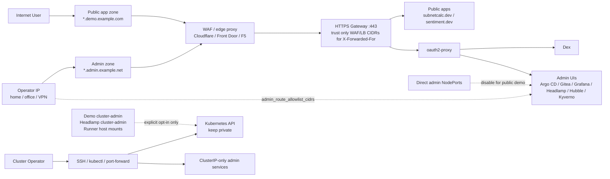

# OWASP Analysis

This repo's Kubernetes stacks were designed first as local teaching clusters.
That default is still materially safer than a casual public deployment because
the operator-facing surfaces start life on loopback-oriented DNS and host
bindings. The risk changes once an operator deliberately moves the same stack
onto a VPS, bare-metal node, public VM, or any environment where outside users
can reach the gateway or node network.

This document treats `kubernetes/kind` as the reference path, but the hardening
touches described here were added in the shared
[`terraform/kubernetes`](../terraform/kubernetes) layer so the same guardrails
apply across `kind`, `lima`, and `slicer`.

## Scope

- This is a public-demo hardening note, not a production certification.
- The question is: "what breaks first if an operator turns the local cluster
  into a reachable VPS service?"
- The target operator is assumed to be experimenting on a Hetzner-style VPS or
  similar bare-metal-flavored Kubernetes host.

## Architecture



## Shared Responsibility

| Area | Repo / stack now provides | Operator / infrastructure must still do | If skipped |
| --- | --- | --- | --- |
| Public entrypoint | `platform_base_domain`, `gateway_https_listen_address`, and gateway-only exposure controls | Point the public app zone at the host or WAF, bind or reverse-proxy `:443`, and keep firewalls tight | Users hit the wrong host, or the stack stays accidentally public on the wrong surfaces |
| Admin UI exposure | `platform_admin_base_domain`, `expose_admin_nodeports=false`, and `admin_route_allowlist_cidrs` | Put admin hosts on a tighter zone and keep the allowlist to operator IPs, VPN egress, or jump hosts | Direct NodePort paths can bypass SSO, or the admin surface becomes broadly reachable |
| Edge trust | `gateway_trusted_proxy_cidrs` lets the gateway trust `X-Forwarded-For` only from your WAF/LB tier | Keep the trusted proxy list aligned with Cloudflare, Front Door, F5, or LB source ranges | The allowlist will key off the proxy IP instead of the real client, or worse, trust spoofed headers |
| Control-plane privilege | `enable_demo_cluster_admin_binding=false` is now the safe public-demo choice | Do not leave demo identities with cluster-admin unless you intentionally accept that risk | One leaked demo password becomes full control-plane compromise |
| Dashboard privilege | `headlamp_cluster_role_binding_create=false` and `headlamp_oidc_skip_tls_verify=false` are now available | Create narrower RBAC if Headlamp is needed publicly | A Headlamp issue can become full-cluster compromise |
| Supply chain / runner risk | `public_demo_mode` forces explicit acknowledgement before keeping Docker socket or host app mounts | Disable the Actions runner or isolate it hard if the repo is writable by others | Repo compromise, workflow abuse, or runner takeover can become host-level code execution |
| Network boundary | Shared checks still assume the Kubernetes API stays private | Keep the API server private and front public access through the gateway only | An exposed API server turns any auth or RBAC mistake into direct cluster takeover |

## What Changed In Code

The shared Terraform stack now supports a safer public-demo shape:

- `platform_base_domain` replaces the hardcoded `127.0.0.1.sslip.io` suffix for
  public app URLs and default redirect targets.
- `platform_admin_base_domain` can move Argo CD, Gitea, Dex, Hubble,
  Headlamp, Grafana, Kyverno, and SigNoz onto a separate DNS zone instead of
  keeping them under `*.admin.<platform_base_domain>`.
- `gateway_https_listen_address` lets the HTTPS gateway bind somewhere other
  than loopback when that is intentional.
- `expose_admin_nodeports=false` removes the direct admin NodePort surfaces
  across the shared stack and keeps the admin path behind the gateway.
- `admin_route_allowlist_cidrs` applies a route-scoped allowlist only to the
  admin hosts, leaving public app hosts reachable.
- `gateway_trusted_proxy_cidrs` lets the gateway trust `X-Forwarded-For` only
  from a known WAF/LB tier so the admin allowlist still works behind
  Cloudflare, Front Door, or a fixed F5/LB address range.
- `gitea_local_access_mode=port-forward` remains the narrow path for repo/admin
  bootstrap when direct NodePorts are disabled, by opening a temporary
  loopback-only tunnel on the operator machine running `kubectl`, typically a
  shell on the VPS reached over SSH for a public demo.
- `enable_demo_cluster_admin_binding`, `headlamp_cluster_role_binding_create`,
  and `headlamp_oidc_skip_tls_verify` can now be disabled explicitly.
- `public_demo_mode=true` now forces acknowledgement of the remaining sharp
  edges before the stack will keep them.

The intent is not to hide risk. The intent is to make the risk impossible to
keep by accident.

## OWASP Top 10 Interaction

### A01: Broken Access Control

This was the clearest local-to-public transition risk.

- The earlier stage-900 shape bound `demo@admin.test` directly to
  `cluster-admin`.
- Headlamp could also run with a cluster-wide role binding.
- Argo CD had a direct NodePort path that could sit outside the SSO front door.

Public-demo guidance:

- Set `expose_admin_nodeports = false`.
- Put the admin hosts on `platform_admin_base_domain` if you want a separate
  policy boundary at the DNS/WAF layer.
- Set `admin_route_allowlist_cidrs` to the small operator/VPN CIDR set that
  should reach the admin routes.
- Set `enable_demo_cluster_admin_binding = false`.
- Set `headlamp_cluster_role_binding_create = false` unless you have a smaller
  RBAC profile ready.

### A02: Cryptographic Failures

The local path relies on a local CA and a teaching-grade trust story.

- `headlamp_oidc_skip_tls_verify` is acceptable only as a local troubleshooting
  shortcut.
- A public-facing host should use a real certificate path and keep TLS
  verification on.

Public-demo guidance:

- Set `headlamp_oidc_skip_tls_verify = false`.
- Treat mkcert- or local-CA assumptions as local-only unless you have a real
  trust chain in place.

### A03: Injection

The biggest practical injection path here is not classical SQL injection. It is
workflow or repo-controlled command execution through the in-cluster runner.

- The Actions runner can mount `/var/run/docker.sock`.
- The runner can mount the repo apps directory into jobs.

Public-demo guidance:

- Prefer `enable_actions_runner = false`.
- If you insist on keeping it, treat that as host-execution risk and require
  explicit acknowledgement.

### A04: Insecure Design

The repo's local design assumption was always "the network boundary is local."
That is fine for a teaching cluster and weak for a public demo unless the
boundary is redrawn deliberately.

Public-demo guidance:

- Public access should terminate at the HTTPS gateway.
- Direct admin NodePorts should be off.
- The Kubernetes API should stay private.

### A05: Security Misconfiguration

This is the category most likely to turn a curiosity-driven VPS into someone
else's miner or abuse box.

Examples:

- Public firewall rules that expose `80`, `443`, or NodePort ranges too broadly
- Leaving demo identities or dashboard cluster-admin bindings enabled
- Leaving TLS verification skips in place
- Reusing local-only defaults on a public host

Public-demo guidance:

- Use `public_demo_mode = true`.
- Keep only the minimum inbound rules needed.
- If the gateway sits behind a WAF or load balancer, set
  `gateway_trusted_proxy_cidrs` to that edge tier so client IP allowlisting is
  based on trusted `X-Forwarded-For` data instead of the proxy's own IP.
- Make every risky local shortcut an explicit opt-in.

### A06: Vulnerable And Outdated Components

This repo already pins many chart and image versions, but that does not remove
the operator's patching duty.

Public-demo guidance:

- Re-run image and chart update checks before each exposed deployment.
- Treat `latest` tags as a liability on an exposed host.
- Keep CI/container scans in scope, especially for internet-facing UIs.

### A07: Identification And Authentication Failures

Dex demo users are convenient for learning and poor for exposure.

- Static demo passwords are acceptable only when the whole platform remains
  local or tightly controlled.
- Public demos should assume password leakage, credential reuse, and brute
  force unless the operator adds stronger controls.

Public-demo guidance:

- Do not keep demo cluster-admin.
- Rotate demo credentials if the cluster will be shared.
- Put the public surface behind the gateway and auth path only.

### A08: Software And Data Integrity Failures

The supply-chain angle is the repo sync plus runner path.

- Gitea repo compromise plus an unrestricted runner can become host code
  execution.
- Mutable images and unreviewed workflow changes compound that risk.

Public-demo guidance:

- Disable the runner for public demos unless there is a strong reason not to.
- Keep deployment artifacts pinned and reviewed.

### A09: Security Logging And Monitoring Failures

The stack can deploy Grafana, Prometheus, Hubble, and related tooling, but the
operator still owns retention, alerting, and log review.

Public-demo guidance:

- Keep gateway, auth, and Kubernetes audit signals somewhere you will actually
  inspect.
- Treat repeated failed logins, sudden outbound traffic, and unexpected runner
  activity as incident signals.

### A10: Server-Side Request Forgery

SSRF is not the dominant risk in this repo, but any compromised admin UI or
plugin surface becomes more dangerous if cluster-internal services and metadata
endpoints are easy to reach.

Public-demo guidance:

- Keep network policies on.
- Keep admin services off public NodePorts.
- Keep the control plane private.

## Suggested Public-Demo Override

This is the minimum shape worth calling "public-demo ready" for a VPS learning
environment. Adjust ports and domain names to fit the host.

```hcl
platform_base_domain                 = "demo.example.com"
platform_admin_base_domain           = "admin.example.net"
public_demo_mode                     = true
public_demo_acknowledged             = true
gateway_https_listen_address         = "0.0.0.0"
expose_admin_nodeports               = false
admin_route_allowlist_cidrs          = ["203.0.113.14/32"]
gateway_trusted_proxy_cidrs          = ["198.51.100.10/32"]
gitea_local_access_mode              = "port-forward"
enable_demo_cluster_admin_binding    = false
headlamp_cluster_role_binding_create = false
headlamp_oidc_skip_tls_verify        = false
enable_actions_runner                = false
enable_docker_socket_mount           = false
enable_apps_dir_mount                = false
```

If the gateway is directly internet-facing and not behind a WAF or load
balancer, leave `gateway_trusted_proxy_cidrs = []` so the gateway uses the
direct peer IP instead of trusting forwarded headers.

If you intentionally keep one of the risky shortcuts, set the corresponding
acknowledgement variable and document why:

- `public_demo_allow_demo_cluster_admin = true`
- `public_demo_allow_headlamp_cluster_admin = true`
- `public_demo_allow_actions_runner_host_mounts = true`

## Deployment Checklist

- Point a real DNS name at the VPS and set `platform_base_domain` accordingly.
- Put the public app hosts on `platform_base_domain`.
- Put admin hosts on `platform_admin_base_domain` if you want a separate edge
  policy surface and simpler WAF rules.
- Expose only the public HTTPS entrypoint you actually need.
- Keep the Kubernetes API server private.
- Set `public_demo_mode = true` and `public_demo_acknowledged = true`.
- Set `expose_admin_nodeports = false`.
- Set `admin_route_allowlist_cidrs` to the operator/VPN/jump-host CIDRs that
  should reach Argo CD, Gitea, Hubble, Dex, and the other admin hosts.
- If the gateway is behind a WAF or load balancer, set
  `gateway_trusted_proxy_cidrs` to the edge-tier source CIDRs so the gateway
  trusts `X-Forwarded-For` only from that layer.
- Use `gitea_local_access_mode = "port-forward"` for admin/bootstrap tasks so
  Gitea access stays on a temporary loopback-only tunnel on the machine
  running the operator workflow, typically an SSH session on the VPS rather
  than a public listener.
- Disable `enable_demo_cluster_admin_binding`.
- Disable Headlamp cluster-admin unless you have narrower RBAC ready.
- Disable `headlamp_oidc_skip_tls_verify`.
- Prefer `enable_actions_runner = false`; otherwise treat it as host-level risk.
- Rotate demo passwords before anyone else can reach the host.
- Review firewall, host hardening, and outbound egress controls on the VPS.
- Re-run the stack checks after every public-facing change.

## Bottom Line

The repo is not one firewall rule away from being safe on the public internet.
It is, however, now explicit about where the local assumptions stop. The shared
Terraform layer can produce a safer public-demo profile, and the remaining high
risk shortcuts must now be kept intentionally rather than by default.
