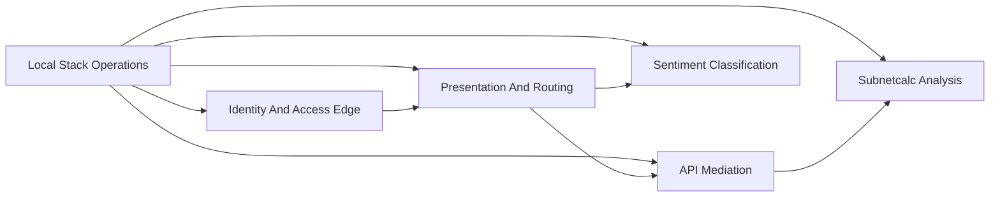

# Candidate Context Map

This is a lightweight context map for the current solution.

It does not claim that the current codebase is already organized by bounded
context. It only names the contexts that are visible in the code and docs
today.

## High-Level Map

## 1. Local Stack Operations

Purpose:
Operate a useful local stack on one machine and make its current ownership,
readiness, and variant shape explicit.

Current language:
platform, solution, variant, target, status, stage, environment, stack,
apply, reset, prereqs, check-health, readiness, blocker, claimed by, shared
host ports.

What it owns:

- choosing which variant is active
- machine-ownership and safety checks
- cumulative stage progression such as `100` through `900`
- environment and route wiring such as `dev`, `sit`, `uat`, and `admin`
- deployment of supporting services and workloads

What it should not own:

- subnet-calculation rules
- sentiment rules
- business meaning hidden behind technical variant names

Current evidence:

- root README and Makefile help
- `tests/makefile.bats`
- `tests/platform-status.bats`
- `tests/assert-variant-active.bats`

## 2. Identity And Access Edge

Purpose:
Authenticate users, establish sessions, and forward user identity into the
rest of the solution.

Current language:
OIDC, SSO, realm, issuer, JWKS, login, logout, userinfo, token, session,
cookie, oauth2-proxy, Dex, Keycloak, Easy Auth.

What it owns:

- browser login and logout
- session cookies
- token validation and issuer configuration
- user identity at the edge of the app

Important note:
This context is implemented with more than one product. Dex is the in-cluster
identity service. Keycloak is the compose-time identity service. The browser
gate should simply be called `oauth2-proxy` in this repo.

## 3. Presentation And Routing

Purpose:
Receive browser traffic, serve UI assets, and route API traffic to the right
backend path.

Current language:
frontend, UI, router, edge, protected frontend, `/api/*`, static assets.

What it owns:

- UI delivery
- request routing
- frontend orchestration across multiple backend checks

Important note:
This is a strong structural concern in the current repo, but it is mostly an
application-layer or delivery-layer concern rather than a core business domain.
Its technical file and service names should not automatically become business
terms.

## 4. API Mediation

Purpose:
Apply policy and forwarding rules between the exposed API surface and the
backend service.

Current language:
APIM simulator, policy, proxy, named values, imports, management service,
resource projection.

What it owns:

- policy enforcement and translation
- API-facing mediation concerns
- a separate hop between public API traffic and the subnet backend

Current scope:
This context appears clearly on the `subnetcalc` path and does not
currently sit on the main shipped `sentiment` path.

## 5. Subnetcalc Analysis

Purpose:
Analyze addresses and networks, then calculate subnet details and cloud-mode
reservation effects.

Current language:
address, network, CIDR, IPv4, IPv6, validation, subnet info, cloud mode,
RFC1918, RFC6598, Cloudflare range check, usable addresses, first usable IP,
last usable IP.

Candidate value objects and domain concepts:

- `Address`
- `Network`
- `CloudMode`
- `SubnetInfo`
- `PrivateRangeMatch`
- `CloudflareRangeMatch`

Current rules already visible in code:

- cloud mode affects IPv4 reservation behavior
- `Azure` and `AWS` reserve more addresses than `OCI` and `Standard`
- `/31` and `/32` are special cases
- IPv6 is modeled separately and does not use the IPv4 reservation rules

This is the clearest current candidate for a richer domain model.

## 6. Sentiment Classification

Purpose:
Classify submitted comments and keep a recent history of classification
results.

Current language:
comment, sentiment label, confidence, mixed signals, classifier, recent
comments, latency.

Candidate value objects and domain concepts:

- `CommentText`
- `SentimentLabel`
- `ClassificationResult`
- `CommentRecord`

Current rules already visible in code:

- text is required for analysis
- the result label is `positive`, `negative`, or `neutral`
- mixed positive and negative cues can produce `neutral`
- recent results are queryable separately from submission

This is a smaller context than subnet analysis, but the domain language is
already fairly coherent.

## Current Solution Paths

Subnet path in the platform demo:

1. Identity and access edge authenticates the browser when SSO is enabled.
2. Presentation and routing split browser traffic from API traffic.
3. API mediation applies policy and forwards the request.
4. Subnetcalc analysis performs the domain calculation.

Sentiment path in the platform demo:

1. Identity and access edge authenticates the browser when SSO is enabled.
2. Presentation and routing split browser traffic from API traffic.
3. Sentiment classification handles the domain request directly.

## Structural Observations

- The current codebase is organized heavily around hosting pattern and stack
  topology.
- The tests are strongest at the platform-stack boundary, not at the
  business-domain boundary.
- `subnetcalc` contains the richest current rule set and is the best
  place to start if the team wants to practice deeper tactical DDD.
- The platform repo itself may still be a valid DDD subject, but its core domain
  is platform operation, not the same thing as the sample app domains.

## Good Next Questions

- What does the platform operator actually promise to a user or team member,
  in domain terms rather than command names?
- Which scenarios should be red tests because they matter to the operator,
  regardless of whether the variant is `kind`, `lima`, or `slicer`?
- Which terms should remain technical implementation names, and which should be
  elevated into the ubiquitous language?
- Should subnet "lookup" become a first-class domain concept, or stay an
  application-service orchestration?
