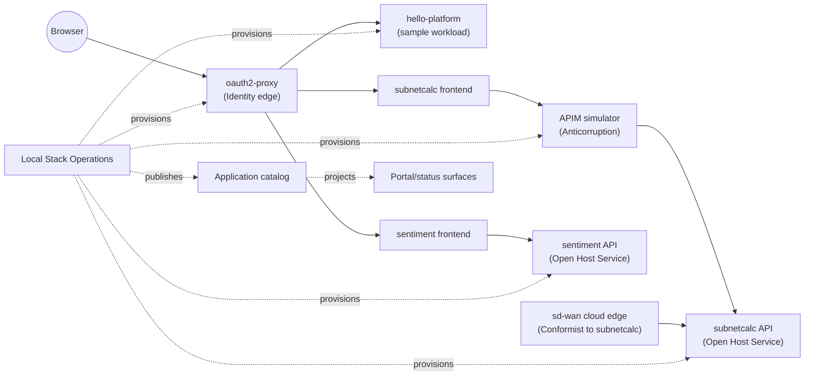

# Contracts Between Contexts

This doc names the contracts that cross bounded contexts in the current
repo, and records which ones are safe to change and which are effectively
frozen pre-launch.

The goal is to make "what counts as a breaking change" explicit. Any edge
listed here is a shipped surface. Internal helpers, private types, and
implementation detail below these edges are not contracts.

## Contract Classes

The classic DDD context-map relationship types are used here as shorthand.

| Class | Meaning in this repo |
| --- | --- |
| `Open Host Service` | a context publishes a stable HTTP API that other contexts consume |
| `Published Language` | the concrete payload shape that an Open Host Service speaks |
| `Anticorruption Layer` | a shim that translates between two languages so neither has to conform to the other |
| `Conformist` | a consuming context that accepts the upstream's shape without translation |
| `Shared Kernel` | a small body of model code shared by more than one context on purpose |
| `Customer / Supplier` | two teams that negotiate upstream changes explicitly |

## Context Map With Relationships

`Local Stack Operations` is not itself a consumer of app APIs. It provisions
the other contexts but does not speak their published languages, so it sits
outside the request path above.

## Edge-By-Edge Contracts

### Browser to Identity Edge

- **Shape:** OIDC flow terminated at `oauth2-proxy`.
- **Class:** Open Host Service. The browser is a Conformist.
- **Published language:** session cookies, `/oauth2/userinfo`, standard OIDC
  endpoints.
- **Session storage:** the browser holds only the session reference; stage
  `900` stores Keycloak-backed `oauth2-proxy` session material in the internal
  SSO session store to avoid oversized token cookies.
- **Identity products underneath:** Keycloak is the current local stage-900
  identity provider. Dex remains a supported provider shape behind
  `sso_provider`. Both are supporting detail behind the `oauth2-proxy` surface.
- **API resource audience:** browser clients use `oauth2-proxy`, but mediated
  API calls should validate a resource audience owned by the API mediation
  layer. The Kubernetes stage uses `apim-simulator` as that audience.
- **Safe pre-launch changes:** adding claims that are already in the token,
  tightening cookie flags.
- **Breaking changes:** renaming the proxy path prefix, changing
  `/oauth2/userinfo` payload keys, swapping identity products in a way that
  changes claim names downstream.

### Identity Provider to Platform Tools

- **Shape:** OIDC clients and group claims consumed by Argo CD, Headlamp,
  Kubernetes API OIDC wiring, and `oauth2-proxy`.
- **Class:** Open Host Service from the identity provider; platform tools are
  Conformists.
- **Published language:** issuer URL, JWKS URL, userinfo URL, client IDs
  (`oauth2-proxy`, `argocd`, `headlamp`, `apim-simulator`), `groups` claim,
  `platform-admins`, `platform-viewers`, and app groups such as
  `app-subnetcalc-dev` and `app-hello-platform-dev`.
- **Secret lifecycle:** client secrets, the `oauth2-proxy` cookie secret, and
  Keycloak Postgres password are generated during apply and projected through
  Kubernetes Secrets. Demo user passwords come from operator input.
- **Safe pre-launch changes:** adding new groups, adding new clients, adding
  optional claims, rotating generated secrets with matching consumer updates.
- **Breaking changes:** renaming the `groups` claim, changing existing client
  IDs, removing platform groups, or changing Argo CD admin/read-only group
  mapping without a migration note.

### Identity Edge to Apps

- **Shape:** the app sees a forwarded identity based on the configured
  `auth_method`.
- **Class:** Conformist. Apps accept whatever headers the selected auth method
  injects.
- **Auth method enum** (authoritative in `apps/subnetcalc/api-fastapi-container-app/app/auth_utils.py`):
  - `none` — caller identity is `"anonymous"`
  - `api_key` — middleware validates `X-API-Key`; identity is `"api_key_user"`
  - `jwt` — `Authorization: Bearer <token>`, identity from `sub` claim
  - `azure_swa` — base64 `x-ms-client-principal` header, identity from
    `userDetails` then `userId`
  - `apim` — `X-User-ID` and `X-User-Email` headers injected by APIM
- **Safe pre-launch changes:** adding a new auth method value; documenting
  additional optional headers that apps already ignore.
- **Breaking changes:** renaming enum values, changing the header names above,
  or removing `"anonymous"` / `"api_key_user"` sentinel identities.

### Frontend to `subnetcalc` API

- **Shape:** REST under `/api/v1/...`.
- **Class:** Open Host Service published by `subnetcalc`. Frontends conform.
- **Published endpoints (authoritative in
  `apps/subnetcalc/api-fastapi-container-app/app/routers/`):**
  - `GET /api/v1/health`
  - `POST /api/v1/ipv4/validate`, `POST /api/v1/ipv6/validate`
  - `POST /api/v1/ipv4/check-private`
  - `POST /api/v1/ipv4/check-cloudflare`, `POST /api/v1/ipv6/check-cloudflare`
  - `POST /api/v1/ipv4/subnet-info`, `POST /api/v1/ipv6/subnet-info`
  - `GET /api/v1/network/diagnostics` (SD-WAN viewpoint)
- **Shared types:** the React and TypeScript-Vite frontends both consume
  `@subnetcalc/shared-frontend`, which holds the wire types. That package is a
  deliberate Shared Kernel between frontends, not between a frontend and the
  backend.
- **`lookup` is a frontend orchestration**, not a backend endpoint. It
  composes `validate`, `check-private`, `check-cloudflare`, and `subnet-info`
  and records per-call timing. This stays a frontend concept pre-launch.
- **Safe pre-launch changes:** adding new optional response fields; adding
  new endpoints (including an additive `/lookup`).
- **Breaking changes:** renaming any existing endpoint, changing a request
  field name, dropping a response field, narrowing accepted `mode` values,
  changing HTTP verbs.

### Frontend to `sentiment` API

- **Shape:** REST under `/api/v1/...`.
- **Class:** Open Host Service published by `sentiment`. Frontend conforms.
- **Published endpoints (authoritative in
  `apps/sentiment/api-sentiment/server.js`):**
  - `GET /api/v1/health` — also ensures the comment store exists
  - `GET /api/v1/comments` — recent comments, newest first
  - `POST /api/v1/comments` — submit a comment for analysis
- **Safe pre-launch changes:** adding optional response fields such as
  `latency_ms` variants; loosening request validation.
- **Breaking changes:** renaming endpoints, changing comment record field
  names, removing the newest-first ordering guarantee, changing the
  `{positive,negative,neutral}` label vocabulary.

### APIM Simulator to `subnetcalc` Backend

- **Shape:** HTTP mediation layer between the exposed API surface and the
  backend service.
- **Class:** Anticorruption Layer. APIM speaks its own language (routes,
  versions, subscriptions, policies, named values, management projections) and
  forwards a narrower shape to the backend.
- **Published language toward clients:** `Ocp-Apim-Subscription-Key` header,
  host-based routing, version routing by header/query/segment.
- **Identity input:** APIM consumes configured OIDC issuer, JWKS URI, and
  audience values. In the Kubernetes stage, those values point to Keycloak and
  the `apim-simulator` resource audience. In Compose or another platform, the
  same APIM runtime can be configured with a different issuer or no identity
  provider at all.
- **Contract evidence:**
  [`apps/subnetcalc/apim-simulator/contracts/contract_matrix.yml`](../../apps/subnetcalc/apim-simulator/contracts/contract_matrix.yml)
  is the canonical record of APIM contract IDs (`GW-HEALTH`,
  `ROUTE-HOST-MATCH`, `ROUTE-VERSION-HEADER`, and so on).
- **Safe pre-launch changes:** adding new contract IDs with
  `status: supported`; adding optional policies that pass through unchanged;
  changing the stage-specific issuer/JWKS/audience configuration without
  changing APIM's own contract language.
- **Breaking changes:** changing the subscription-key header name, altering
  how version routing resolves, or removing a contract ID that shipped as
  `supported`.

### sd-wan Cloud Edge to `subnetcalc`

- **Shape:** HTTP over WireGuard with mTLS termination at the cloud2 nginx
  edge; reached by vanity name (`api1.vanity.test`) that resolves to a VIP.
- **Class:** Conformist. `sd-wan/lima` does not negotiate the `subnetcalc`
  API shape.
- **Edge headers:** `X-Ingress-Cloud`, `X-Egress-Cloud`, `X-Client-CN`,
  `X-Client-Verify` are the mTLS attribution contract.
- **Safe pre-launch changes:** adding optional attribution headers;
  publishing additional vanity names that resolve to the same VIP.
- **Breaking changes:** changing the header names above, changing the VIP
  allocation in a way that existing DNS answers no longer cover, or altering
  the expected mTLS client CN.

### Stack Operations to Apps

- **Shape:** service catalog and application/environment intent are rendered
  into Kubernetes manifests under `terraform/kubernetes/apps/`, Argo CD
  Applications, route hostnames, image inputs, and Gitea repo pushes for GitOps
  reconciliation.
- **Class:** Supplier/Customer. The Stack Operations context is upstream; the
  apps are downstream consumers of image tags, namespaces, and ingress
  hostnames.
- **Shared contract surface:**
  - the first-class service catalog at `catalog/platform-apps.json`, including
    application specs, owners, environments, app/environment RBAC groups,
    secret bindings, deployment records, and scorecards
  - image tag publication (waited on by
    `wait_sentiment_images`, `wait_subnetcalc_images`)
  - Gitea org and repos (`sync_gitea_app_repo_sentiment`,
    `sync_gitea_app_repo_subnetcalc`)
  - ingress hostnames and the SSO path enabled at stage `900`
  - environment requests rendered by `terraform/kubernetes/scripts/idp-environment.sh`
    for apps such as `hello-platform`
  - environment namespaces labeled with
    `platform.publiccloudexperiments.net/environment`
  - namespace roles labeled with
    `platform.publiccloudexperiments.net/namespace-role`
- **Safe pre-launch changes:** publishing additional tags, adding repos to
  the Gitea org, adding new ingress aliases, adding catalog entries for new
  app/environment pairs, and adding new scorecard or secret-binding metadata.
- **Breaking changes:** renaming the existing workload repos, renaming image
  namespaces, changing established app/environment names, changing namespace
  role label values, or changing ingress hostnames that runbooks assume.

### Application Catalog to Portal/Status Surfaces

- **Shape:** read-side projection of app and platform surfaces into Argo CD,
  Grafana Launchpad tiles, Prometheus expressions, and `platform status` JSON.
- **Class:** Published Language. Portal and status consumers conform to the
  current projection shape.
- **Published language:** Launchpad tile fields (`title`, `url`, `sort_key`,
  `requires`, `expr`), Argo CD Application names, `platform status` keys such
  as `active_variant`, `variants`, `actions`, and health words such as
  `Healthy`, `Synced`, and `Down`.
- **Safe pre-launch changes:** adding Launchpad tiles, adding optional status
  fields, adding new action entries, adding Prometheus fallback expressions.
- **Breaking changes:** renaming existing status JSON keys, removing existing
  tile fields, changing existing Argo CD Application names, or changing health
  labels that dashboards/runbooks already display.

## Shared Kernel Candidates

Today there is exactly one genuine Shared Kernel:

- **`@subnetcalc/shared-frontend`** — wire types and API helpers consumed by
  both `frontend-react` and `frontend-typescript-vite`.

Candidates that are **not** Shared Kernels yet, and should not be turned into
ones pre-launch:

- the auth-method enum (`none` / `api_key` / `jwt` / `azure_swa` / `apim`)
  appears only in `subnetcalc` today. Sentiment does not define it. Promoting
  it to a shared package now would require renaming at the consumer and is a
  breaking change.
- `/network/diagnostics` exists in both `subnetcalc` and in
  `sd-wan/lima/api/main.py`. Extracting a shared payload is tempting but
  post-launch.

## What Is Safe To Change Pre-Launch

Changes in this list do not break any of the edges above.

- **Internal refactors:**
  - Extract `CommentAnalysisPolicy` inside sentiment (neutralization rules).
  - Name value objects (`Address`, `Network`, `CloudMode`, `SubnetInfo`,
    `CloudflareMembership`) as internal Python classes.
  - Split `get_current_user` per auth method without changing the returned
    identity string shape.
- **Additive API changes:**
  - Add `POST /api/v1/lookup` on `subnetcalc` that composes the existing four
    calls and returns the same fields the frontend already assembles.
  - Add new optional response fields on any existing endpoint.
  - Add new contract IDs to `contract_matrix.yml`.
- **Documentation changes:**
  - Use ratified stage labels (`cluster available`, `app repos`,
    `observability`, `SSO`) in docs and runbooks while keeping Makefile
    target names unchanged.
  - Use product nouns (`oauth2-proxy`, `Cilium`, `Argo CD`, `Gitea`,
    `Headlamp`) where they are already the real operator language.

## What Is Risky Pre-Launch

Avoid these unless you are prepared to bump versions on at least one shipped
surface.

- Renaming any published endpoint on either app API.
- Renaming `provider` in operator `status` output; scripts and tests parse
  it.
- Renaming Makefile stage targets even if the ratified label differs.
- Changing auth-method enum values or the headers each method implies.
- Changing APIM subscription-key header name.
- Changing the four sd-wan edge headers (`X-Ingress-Cloud`,
  `X-Egress-Cloud`, `X-Client-CN`, `X-Client-Verify`).
- Collapsing the two `subnetcalc` API delivery shapes
  (`api-fastapi-azure-function` and `api-fastapi-container-app`). They share a
  domain core but ship as separate artifacts today.

## How To Add A New Contract

1. Add the edge to the mermaid diagram above.
2. Write the shape, class, published language, safe changes, and breaking
   changes for it.
3. If it introduces a Shared Kernel, name the package explicitly.
4. Link any authoritative implementation file.

If a proposed change does not fit cleanly as safe or risky, treat it as
risky until an explicit decision is recorded here.
