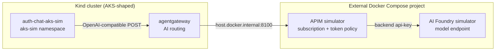

# Kind AKS-Shaped AI Foundry Egress

This local experiment proves an in-cluster workload can reach a Docker-hosted
AI Foundry endpoint only through the approved broker path:

```text
auth-chat-aks-sim -> agentgateway -> apim-simulator -> aifoundry-simulator
```

The two simulator images are built from the sibling checkouts at
`../apim-simulator` and `../aifoundry-simulator` relative to the `platform`
checkout. The sibling repositories remain unchanged.

## Architecture



APIM accepts the workload subscription credential from agentgateway, replaces
it with the AI Foundry backend key, applies `llm-token-limit`, and records an
opt-in trace. AI Foundry returns a deterministic completion and real usage
fields suitable for exercising gateway token policy.

## AKS-shaped, not an AKS emulator

The experiment models the application-facing behavior needed for this path:

- worker nodes carry `kubernetes.azure.com/agentpool`, cluster, region, and
  zone labels;
- the workload selects the simulated agent pool;
- restricted Pod Security and hardened container settings apply;
- Cilium permits the workload to call only agentgateway;
- agentgateway alone may egress to the external APIM port.

It does not simulate the AKS managed control plane, Azure CNI implementation,
Azure load balancers, Entra federation, managed identities, or the Azure
Workload Identity token exchange. The Azure-style labels are scheduling
metadata for the lab, not evidence that those managed Azure services exist.

## Prerequisites

- Docker Desktop or Docker Engine is running.
- `kind-local` is at the platform stage that provides Cilium and agentgateway.
  Stage `900` is the normal confidence path.
- The sibling repositories exist at the default locations:
  `~/Developer/personal/apim-simulator` and
  `~/Developer/personal/aifoundry-simulator`.
- The Kind kubeconfig exists at `~/.kube/kind-kind-local.yaml`.
- Host ports `8100` (APIM) and `8020` (AI Foundry) are free.

The build uses an experiment-local Docker configuration under `.run/` so
public image pulls do not invoke the interactive Docker Desktop credential
helper. `dhi.io` continues to use the platform file-backed credential helper.

## Run

From the platform repository root:

```shell
make -C experiments/kind-aks-ai-foundry up
make -C experiments/kind-aks-ai-foundry check
```

`check` proves all five observable properties:

1. `auth-chat-aks-sim` is scheduled onto the AKS-shaped worker.
2. APIM returns `401` when called without a subscription credential.
3. a temporary pod with the workload policy identity cannot call APIM or AI
   Foundry directly, while both endpoints are healthy from the host.
4. `POST /chat` returns model status `ok` and non-zero token usage.
5. APIM stores a trace whose upstream is
   `http://aifoundry-simulator:8000/openai/v1/chat/completions`.

Preview startup without changing Docker or Kubernetes:

```shell
make -C experiments/kind-aks-ai-foundry up DRY_RUN=1
```

## Stop

```shell
make -C experiments/kind-aks-ai-foundry down
```

Teardown removes only the `aks-sim` namespace, the experiment-owned
agentgateway route/backend/Secret and Cilium policy, the four AKS simulation
labels, and the experiment Compose project. It does not delete or reset the
Kind cluster.

Preview teardown with:

```shell
make -C experiments/kind-aks-ai-foundry down DRY_RUN=1
```

All credentials in this experiment are intentional local simulator values.
Keep both published ports bound to loopback and do not expose this stack to the
internet.
