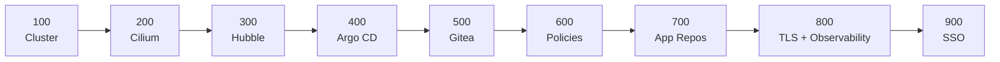
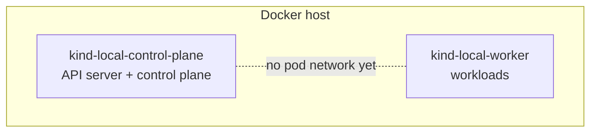
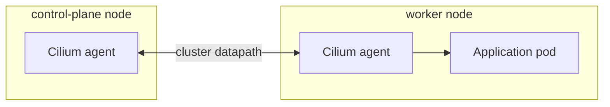
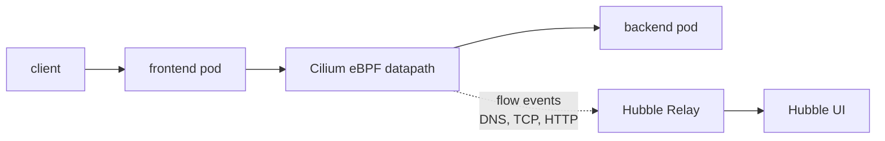
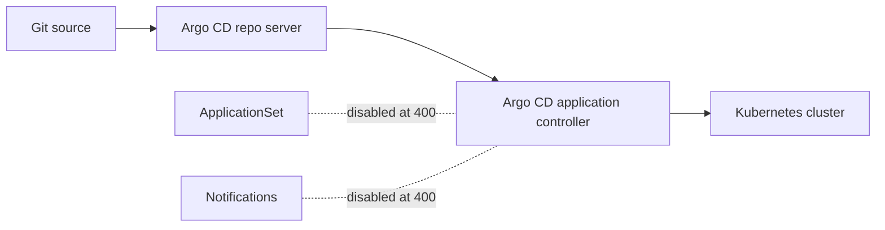
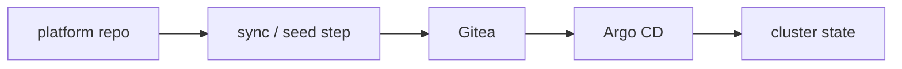
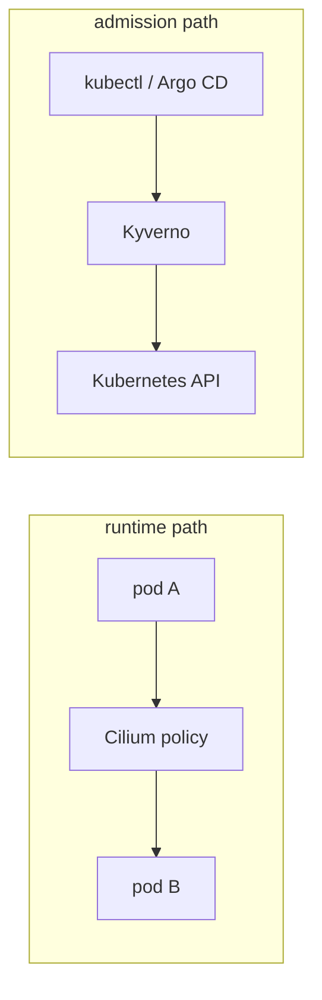
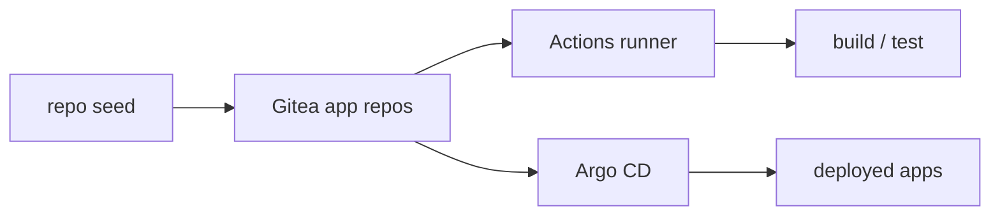
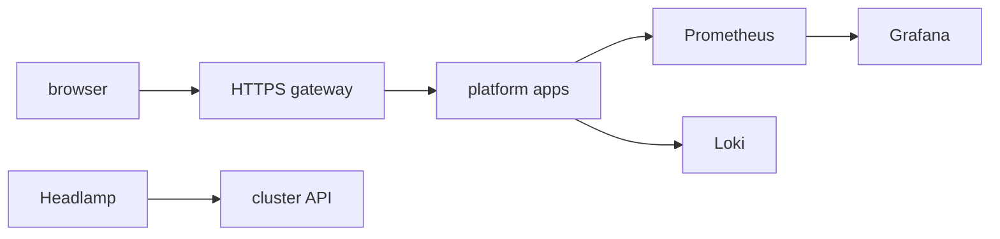
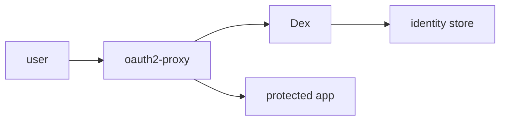

# kind

Local Kubernetes cluster, built in cumulative stages from a bare kind bootstrap to a full local platform stack.

## Environment

This README covers the Docker-backed teaching path for the repo.

- Validated on macOS with Docker Desktop.
- Validated on Linux with a local Docker daemon.
- On macOS, Docker Desktop must be running before you plan, apply, or reset.
- On Linux, Docker Engine is enough; Docker Desktop is not required.
- `kind` is still required on a bare Ubuntu host even if Docker is already installed.

## Operational truths

- Stage `100` is expected to look unhealthy. The cluster exists, but there is no CNI until stage `200` installs Cilium.
- The stage model is cumulative. `make kind apply 900` means "bring the stack to the stage-900 shape", not "apply only the last step".
- Treat every planned destroy as something to explain before apply. In this stack, some `null_resource` replacements are expected orchestration churn, but they should still be inspected.
- kind uses the local Docker daemon. On macOS that normally means Docker Desktop; on Linux Docker Engine is enough.
- Exposed service ports bind to `127.0.0.1`, not `0.0.0.0`, so the local platform stays local and can coexist with other local VM-based stacks.
- `make reset` is destructive local cleanup. Without `AUTO_APPROVE=1`, it should prompt before removing cluster, kubeconfig, or local state.
- The repo-owned kubeconfig stays at `~/.kube/kind-kind-local.yaml` by default. Use `kubie` to work across split kubeconfigs, and only run `make merge-default-kubeconfig` if you intentionally want this context copied into `~/.kube/config`.
- Stage `900` is the confidence path when you drive it through `make`. On the host, a successful `make kind apply 900` also runs `check-health` and `check-sso-e2e` before returning success. In the devcontainer, the stage-900 apply path stops at `check-health`; browser E2E remains host-oriented. Raw Terragrunt/OpenTofu applies remain apply-only.

## Prerequisites

Install a working Docker daemon first. On macOS that usually means Docker Desktop. On Linux, Docker Engine or Docker Desktop is fine. The commands below use Homebrew for the CLI toolchain, but `make prereqs` is the source of truth for what must exist.

Core tools:

```bash
brew install jq kind kubernetes-cli make opentofu terragrunt
```

Browser/E2E tools:

```bash
brew install bun node
```

On the host, `make -C kubernetes/kind 900 apply` runs `check-sso-e2e` before it
returns success, so `bun` and `node` are part of the practical stage-900
toolchain.
`node` provides `npm` and `npx`; Playwright stays project-local in the repo.

Optional tools:

```bash
brew install cilium-cli helm hubble kubectx kubie kyverno mkcert yamllint yq
mkcert -install
```

Then start the Docker daemon, give it enough resources, and run:

```bash
make prereqs
```

The default operator shape is now a split kubeconfig plus `kubie`, not a repo
context merged into `~/.kube/config`.

Why these tools exist, what `make prereqs` checks, and the extra host-side LLM requirement for the sentiment demo are documented in [docs/prerequisites.md](docs/prerequisites.md).

## Preferred command syntax

Run from `platform/kubernetes/kind`:

```bash
make kind plan 100
make kind apply 100 AUTO_APPROVE=1
make kind apply 900 AUTO_APPROVE=1
make reset AUTO_APPROVE=1
```

If you prefer to stay at repo root, use `make -C kubernetes/kind ...`.

This wrapper drives the Terraform stack in `../../terraform/kubernetes` using the kind target profile in `targets/kind.tfvars`.

Why Terragrunt is here, why OpenTofu is the default, and the raw non-`make` commands are documented in [docs/tooling.md](docs/tooling.md).

Image preloading is explicit. The preload helper still stays opt-in:

- `KIND_PRELOAD_IMAGES_MODE=off` means `apply` does not preload images for you.
- `KIND_PRELOAD_IMAGES_MODE=auto|on` tells `apply` to run the existing
  `preload-images` step before Terraform.

Kind now also has an operator-facing image distribution knob. The default is the faster Docker Desktop path:

- `KIND_IMAGE_DISTRIBUTION_MODE=registry` is the default. It disables `kind load`, disables the in-cluster Actions runner path, mirrors the hot image set into the shared host registry on `127.0.0.1:5002`, and points workload manifests at `host.docker.internal:5002/...`.
- `KIND_IMAGE_DISTRIBUTION_MODE=load` keeps the old `kind load` path.
- `KIND_IMAGE_DISTRIBUTION_MODE=hybrid` does the same registry-based workload path, but also requires `KIND_BAKED_NODE_IMAGE=<image-ref>` so the stable node hot set can already be present in the custom kind node image.
- `KIND_IMAGE_DISTRIBUTION_MODE=baked` disables `kind load` and uses `KIND_BAKED_NODE_IMAGE=<image-ref>`, while leaving the later-stage in-cluster Actions path intact.

The registry path is intentionally the portable cache model. The same host-side registry can be reused by other targets; `kind` just consumes it through `host.docker.internal:5002`.

The full Kind path remains the reference/default shape. Its target profile pins
`gitea_local_access_mode = "nodeport"`, so host-side automation continues to
use the stable localhost NodePorts that Kind already owns.

## Stage ladder

Stages are cumulative. `make kind apply 300 AUTO_APPROVE=1` means "bring the cluster to the stage-300 shape", not "run only stage 300 in isolation".



| Stage | Intent | Main toggles |
| --- | --- | --- |
| `100` | Provision the cluster only. | `worker_count=1`, `cni_provider="none"`, `kind_disable_default_cni=true` |
| `200` | Install Cilium as the CNI. | `cni_provider="cilium"` |
| `300` | Add Hubble on top of Cilium. | `enable_hubble=true` |
| `400` | Add Argo CD for GitOps. | `enable_argocd=true`, `argocd_applicationset_enabled=false`, `argocd_notifications_enabled=false` |
| `500` | Add Gitea and re-enable the full Argo CD controller set. | `enable_gitea=true`, `argocd_applicationset_enabled=true`, `argocd_notifications_enabled=true` |
| `600` | Add Kyverno and Cilium policy controls. | `enable_policies=true`, `enable_cert_manager=true`, `enable_cilium_wireguard=true` |
| `700` | Seed application repos and add the in-cluster runner. | `enable_actions_runner=true`, app repo flags enabled |
| `800` | Add HTTPS routes and platform observability. | `enable_gateway_tls=true`, `enable_headlamp=true`, `enable_prometheus=true`, `enable_grafana=true`, `enable_loki=true` |
| `900` | Add single sign-on with Dex and `oauth2-proxy`. | `enable_sso=true` |

## Stage-by-stage control knobs

### Stage 100: cluster only

Stage 100 renders a minimal kind cluster: one control-plane node and one worker node. It is intentionally created without a pod network so later stages can install Cilium without recreating the cluster.



- `worker_count = 1` creates a 2-node cluster: 1 control-plane node and 1 worker node.
- `KIND_WORKER_COUNT` overrides that worker count at the wrapper layer. `1` means 2 total nodes, `2` means 3 total nodes, and so on.
- `cni_provider = "none"` and `kind_disable_default_cni = true` mean there is no working pod network yet.
- `kubeconfig_context = ""` leaves bootstrap free to create the cluster before the final context name exists.

Stage 100 also reserves the host ports that later stages will use. The Kind port mappings are defined in [`locals.tf`](../../terraform/kubernetes/locals.tf) and the default values for this stage live in [`100-cluster.tfvars`](stages/100-cluster.tfvars).

| Host bind | Var(s) | Intended later use |
| --- | --- | --- |
| `127.0.0.1:6443` | `kind_api_server_port` | Kubernetes API server |
| `127.0.0.1:443` | `gateway_https_host_port` -> `gateway_https_node_port=30070` | HTTPS gateway at stage `800+` |
| `127.0.0.1:30080` | `argocd_server_node_port` | Argo CD UI at stage `400+` |
| `127.0.0.1:31235` | `hubble_ui_node_port` | Hubble UI at stage `300+` |
| `127.0.0.1:30090` | `gitea_http_node_port` | Gitea HTTP at stage `500+` |
| `127.0.0.1:30022` | `gitea_ssh_node_port` | Gitea SSH at stage `500+` |
| `127.0.0.1:3302` | `grafana_ui_host_port` -> `grafana_ui_node_port=30302` | Grafana UI at stage `800+` |

If any of those host ports are already taken on your machine, override them in a local tfvars file and pass that via `PLATFORM_TFVARS=...`. The preflight check in `make kind apply ...` uses [`check-kind-host-ports.sh`](scripts/check-kind-host-ports.sh) to catch conflicts before apply.

Expected behavior: after stage 100, the cluster exists, but node and pod readiness will look wrong because there is no CNI yet.

### Stage 200: add Cilium as the CNI

Stage 200 installs [Cilium](https://docs.cilium.io/en/stable/overview/intro/) as the cluster's [Container Network Interface (CNI)](https://kubernetes.io/docs/concepts/extend-kubernetes/compute-storage-net/network-plugins/). In practice, this is the point where pod-to-pod networking becomes real and the cluster starts looking healthy.



- `cni_provider = "cilium"` switches networking over to Cilium.
- `kubeconfig_context = "kind-kind-local"` locks later stages to the created cluster context.
- `enable_hubble = false` keeps observability off for one stage so networking can settle first.

### Stage 300: add Hubble

Stage 300 turns on [Hubble](https://docs.cilium.io/en/stable/observability/hubble/index.html), Cilium's network observability layer. Hubble sits on top of Cilium and uses [eBPF](https://ebpf.io/what-is-ebpf/) flow data to show who is talking to whom, which requests are allowed or denied, and, when available, L7 details such as HTTP method, path, and status.



- `enable_hubble = true` enables Hubble Relay and the UI.
- `cni_provider = "cilium"` stays unchanged because Hubble is additive to Cilium, not a separate network layer.
- `hubble_ui_node_port = 31235` exposes the UI for local inspection.

Think of the split this way:

- Cilium is the datapath and policy engine.
- Hubble is the visibility layer over that datapath.

### Stage 400: add Argo CD for GitOps

Stage 400 introduces [Argo CD](https://argo-cd.readthedocs.io/) so the cluster can reconcile itself from Git. This stage keeps the rollout intentionally conservative by enabling the core Argo CD control plane first, while leaving ApplicationSet and Notifications off until the next step.



- `enable_argocd = true` adds the GitOps control plane.
- `argocd_applicationset_enabled = false` limits the initial controller footprint.
- `argocd_notifications_enabled = false` keeps the early install smaller and quieter.

### Stage 500: add Gitea and the full Argo CD controller set

Stage 500 brings [Gitea](https://about.gitea.com/) into the cluster and turns the rest of Argo CD back on. This is the point where the platform starts to look like a self-hosted GitOps environment rather than just a cluster with add-ons.



- `enable_gitea = true` adds the in-cluster Git service.
- `argocd_applicationset_enabled = true` re-enables Argo CD fan-out patterns.
- `argocd_notifications_enabled = true` restores the full controller set after the core install is stable.

### Stage 600: add policy controls

Stage 600 adds the policy layer. The useful mental model is that Cilium policies control runtime network paths, while Kyverno policies control what Kubernetes objects are allowed or mutated at admission time.



- `enable_policies = true` turns on the policy stack.
- `enable_cilium_wireguard = true` adds encrypted node-to-node transport in the Cilium layer.
- `enable_cert_manager = true` lays groundwork for the later TLS stages.

### Stage 700: add app repos and the in-cluster runner

Stage 700 is where the demo app supply chain becomes concrete. The platform seeds the app repos into Gitea, enables the in-cluster runner, and gives Argo CD real application sources to watch.



- `enable_actions_runner = true` adds the in-cluster CI executor.
- `enable_app_repo_subnet_calculator = true` and `enable_app_repo_sentiment = true` seed the demo application repos.
- `llm_gateway_mode = "direct"` keeps the local demo path simple for the LLM-backed sample app.

With the default `KIND_IMAGE_DISTRIBUTION_MODE=registry` path, the served workloads stay the same but this stage takes the faster Docker-host route instead: the host registry becomes the image source of truth and the in-cluster Actions runner path is disabled for that run. Switch back to `load` if you explicitly want the old `kind load` behavior.

The demo applications are explained in [docs/sample-apps.md](docs/sample-apps.md).

### Stage 800: add TLS, Headlamp, and observability

Stage 800 makes the platform feel more like a real environment: HTTPS routes are enabled, Headlamp is added for cluster UI access, and the Prometheus/Grafana/Loki stack comes online for metrics and logs.



- `enable_gateway_tls = true` switches platform routes to HTTPS.
- `enable_headlamp = true` adds a Kubernetes dashboard.
- `enable_prometheus = true`, `enable_grafana = true`, and `enable_loki = true` add the core observability stack.

### Stage 900: add single sign-on with Dex

Stage 900 adds [Dex](https://dexidp.io/) and `oauth2-proxy`, then swaps the gateway routes to the SSO-protected set. From here on, the platform is not just encrypted; it is also fronted by a login flow.



- `enable_sso = true` enables Dex and the `oauth2-proxy` layer.
- `platform_gateway_routes_path = "apps/platform-gateway-routes-sso"` switches the ingress routes to the protected variant.
- The earlier TLS and gateway work from stage 800 remains in place; stage 900 adds authentication on top.

## Reset

```bash
make reset AUTO_APPROVE=1
```

`make reset` is the normal way to tear down this kind environment.

`make stop-kind` and `make start-kind` are lower-level helpers that stop or start the Docker containers backing the kind nodes. They pause and resume the cluster containers; they do not reprovision the cluster.

## Useful troubleshooting command

```bash
../../terraform/kubernetes/scripts/preload-images.sh --cluster kind-local --parallelism 4 --image-list ./preload-images.txt 2>&1 | tee /tmp/preload.log
```
