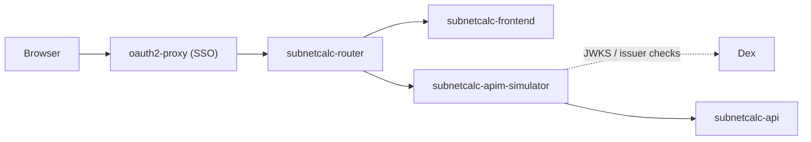
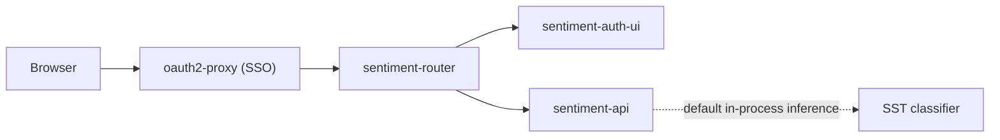

# Sample Apps

The demo applications appear from stage `700` onward.

The application source trees live under [apps/README.md](../../../apps/README.md).

For the fuller static architecture and policy-control view, see:

- [`apps-c4.md`](../../../terraform/kubernetes/docs/apps-c4.md) for the Mermaid native C4 architecture model
- [`COMPOSITION.md`](../../../terraform/kubernetes/cluster-policies/COMPOSITION.md)

## Subnetcalc

`subnetcalc` is deliberately split so the frontend never talks to the backend directly. The router sends UI traffic to the frontend and `/api/*` traffic to the APIM simulator, which then forwards to the backend.

With SSO enabled at stage `900`, the path looks like this:

Without SSO, remove the `oauth2-proxy` hop and start at `subnetcalc-router`.

The important split is:

- frontend traffic stays on `subnetcalc-frontend`
- API traffic goes through `subnetcalc-apim-simulator`
- the router does not call `subnetcalc-api` directly

That routing is documented in:

- [`subnetcalc-router-nginx` in all.yaml](../../../terraform/kubernetes/apps/workloads/base/all.yaml)
- [`subnetcalc-l7-dev.yaml`](../../../terraform/kubernetes/cluster-policies/cilium/dev/subnetcalc-l7-dev.yaml)
- [`apim/all.yaml`](../../../terraform/kubernetes/apps/apim/all.yaml)

## Sentiment

The `sentiment` demo has the same frontend/router split, but unlike
`subnetcalc` it does not add an APIM hop. The router sends browser routes to
the UI and `/api/*` directly to `sentiment-api`.

With SSO enabled at stage `900`, the shipped kind-stage path looks like this:

Without SSO, remove the `oauth2-proxy` hop and start at `sentiment-router`.

For the shipped kind stages, the key points are:

- `sentiment-router` talks to `sentiment-auth-ui` and `sentiment-api`, not to an APIM simulator
- `sentiment-api` serves the default SST classifier in-process
- the shared workload config keeps inference inside `sentiment-api`

That means the shipped kind path does not require a host-side model endpoint
for sentiment to work.
