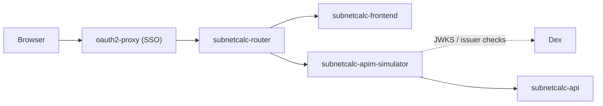
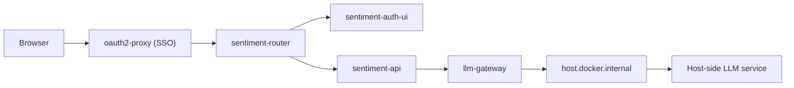
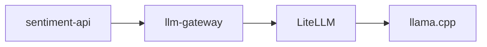

# Sample Apps

The demo applications appear from stage `700` onward.

The application source trees live under [apps/README.md](../../../apps/README.md).

## Subnetcalc

`subnetcalc` is deliberately split so the frontend never talks to the backend directly. The router sends UI traffic to the frontend and `/api/*` traffic to the APIM simulator, which then forwards to the backend.

With SSO enabled at stage `900`, the path looks like this:

Without SSO, remove the `oauth2-proxy` hop and start at `subnetcalc-router`.

The important split is:

- frontend traffic stays on `subnetcalc-frontend`
- API traffic goes through `subnetcalc-apim-simulator`
- the router does not call `subnetcalc-api` directly

That routing is documented in:

- [`subnetcalc-router-nginx` in all.yaml](../../../terraform/kubernetes/apps/workloads/base/all.yaml)
- [`subnetcalc-l7-dev.yaml`](../../../terraform/kubernetes/cluster-policies/cilium/dev/subnetcalc-l7-dev.yaml)
- [`apim/all.yaml`](../../../terraform/kubernetes/apps/apim/all.yaml)

## Sentiment LLM

The `sentiment` demo has the same frontend/router split, but the backend also calls an LLM gateway.

With SSO enabled at stage `900`, the current shipped kind-stage path looks like this:

Without SSO, remove the `oauth2-proxy` hop and start at `sentiment-router`.

For the shipped kind stages, the key point is that `llm-gateway` is host-backed, not an in-cluster model service. The stage tfvars set:

- `llm_gateway_mode = "direct"`
- `llm_gateway_external_name = "host.docker.internal"`

That means the sentiment backend expects a host-side LLM endpoint to exist. In practice that usually means:

- LM Studio running on the host with an OpenAI-compatible API
- a host-side gateway in front of Apple MLX or another local model runtime

## Alternative In-Cluster LLM Mode

The repo also contains an in-cluster LiteLLM path. That shape looks like this:

That mode exists in:

- [`llm-litellm.yaml`](../../../terraform/kubernetes/apps/workloads/base/llm-litellm.yaml)
- [`variables.tf`](../../../terraform/kubernetes/variables.tf)

But it is not the default selected by the checked-in kind stage files for stages `700`, `800`, and `900`.
