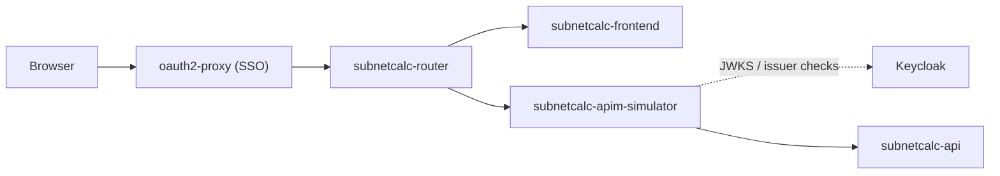
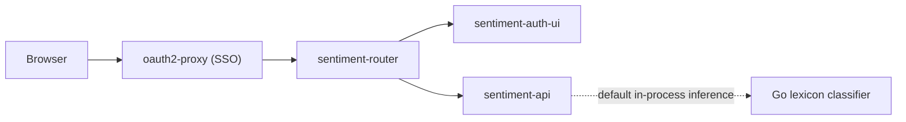

# Sample Apps

The demo applications appear from stage `700` onward.

Each app is its own manifest, so a resource profile can deploy one without the
other:

- [`workloads/base/sentiment.yaml`](../../../terraform/kubernetes/apps/workloads/base/sentiment.yaml)
- [`workloads/base/subnetcalc.yaml`](../../../terraform/kubernetes/apps/workloads/base/subnetcalc.yaml)

`enable_app_repo_sentiment` and `enable_app_repo_subnetcalc` each prune their
own manifest, the matching half of the uat security-context patches, and the
images built for it. The two apps shared one file until 2026-09-06, which meant
turning either off still deployed both and crashlooped the router of the one
that was supposed to be gone.

The application source trees live under [apps/README.md](../../../apps/README.md).

For the fuller static architecture and policy-control view, see:

- [`apps-c4.md`](../../../terraform/kubernetes/docs/apps-c4.md) for the Mermaid native C4 architecture model
- [`COMPOSITION.md`](../../../terraform/kubernetes/cluster-policies/COMPOSITION.md)

## Subnetcalc

`subnetcalc` is deliberately split so the frontend never talks to the backend directly. The router sends UI traffic to the frontend and `/api/*` traffic to the APIM simulator, which then forwards to the backend.

With SSO enabled at stage `900`, the path looks like this:

```mermaid
flowchart LR
    user["Browser"] --> sso["oauth2-proxy (SSO)"]
    sso --> router["subnetcalc-router"]
    router --> fe["subnetcalc-frontend"]
    router --> apim["subnetcalc-apim-simulator"]
    apim -. "JWKS / issuer checks" .-> keycloak["Keycloak"]
    apim --> api["subnetcalc-api"]
```

Without SSO, remove the `oauth2-proxy` hop and start at `subnetcalc-router`.

The important split is:

- frontend traffic stays on `subnetcalc-frontend`
- API traffic goes through `subnetcalc-apim-simulator`
- the router does not call `subnetcalc-api` directly

That routing is documented in:

- [`subnetcalc-router-nginx` in subnetcalc.yaml](../../../terraform/kubernetes/apps/workloads/base/subnetcalc.yaml)
- [`subnetcalc-http-routes.yaml`](../../../terraform/kubernetes/cluster-policies/cilium/projects/subnetcalc/subnetcalc-http-routes.yaml)
- [`apim/all.yaml`](../../../terraform/kubernetes/apps/apim/all.yaml)

## Sentiment

The `sentiment` demo has the same frontend/router split, but unlike
`subnetcalc` it does not add an APIM hop. The router sends browser routes to
the UI and `/api/*` directly to `sentiment-api`.

With SSO enabled at stage `900`, the shipped kind-stage path looks like this:

```mermaid
flowchart LR
    user["Browser"] --> sso["oauth2-proxy (SSO)"]
    sso --> router["sentiment-router"]
    router --> fe["sentiment-auth-ui"]
    router --> api["sentiment-api"]
    api -. "default in-process inference" .-> classifier["Go lexicon classifier"]
```

Without SSO, remove the `oauth2-proxy` hop and start at `sentiment-router`.

For the shipped kind stages, the key points are:

- `sentiment-api` serves the deterministic lexicon classifier in-process
- the shared workload config keeps inference inside `sentiment-api`

One caveat on the diagram above. The manifest as committed sends `/api/*`
through the APIM simulator, the same hop `subnetcalc` uses, and the render step
repoints it at `sentiment-api` when no simulator is deployed. So the direct path
shown here is what you get with APIM off, and the extra hop is what you get on
the default stage-900 shape. nginx refuses to start on an upstream host it
cannot resolve, which is why that rewrite exists rather than leaving the
reference in place.

That means the shipped kind path does not require a host-side LLM endpoint
for sentiment to work.
