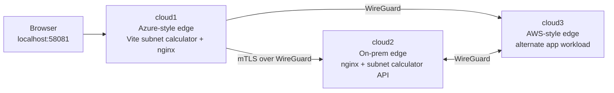
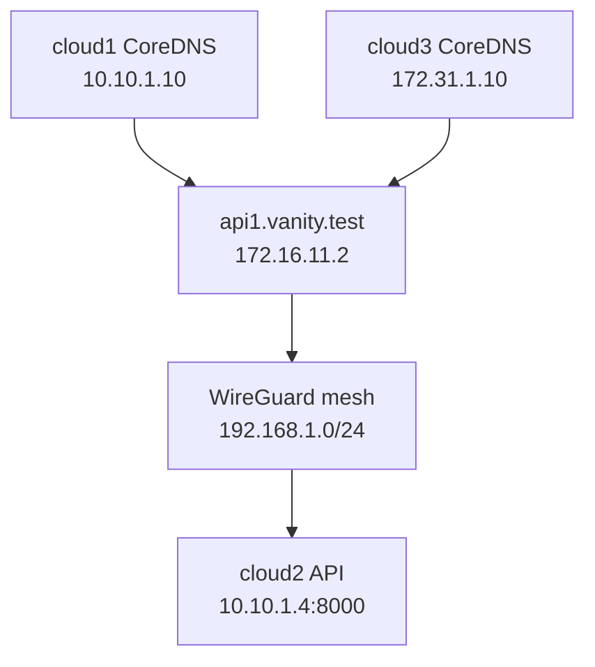
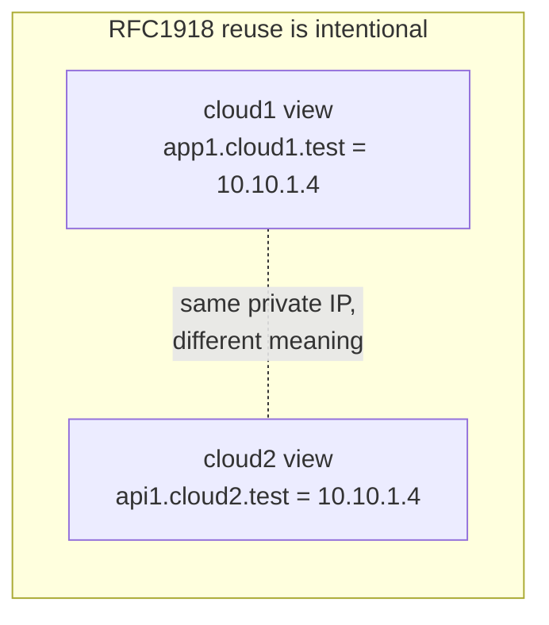
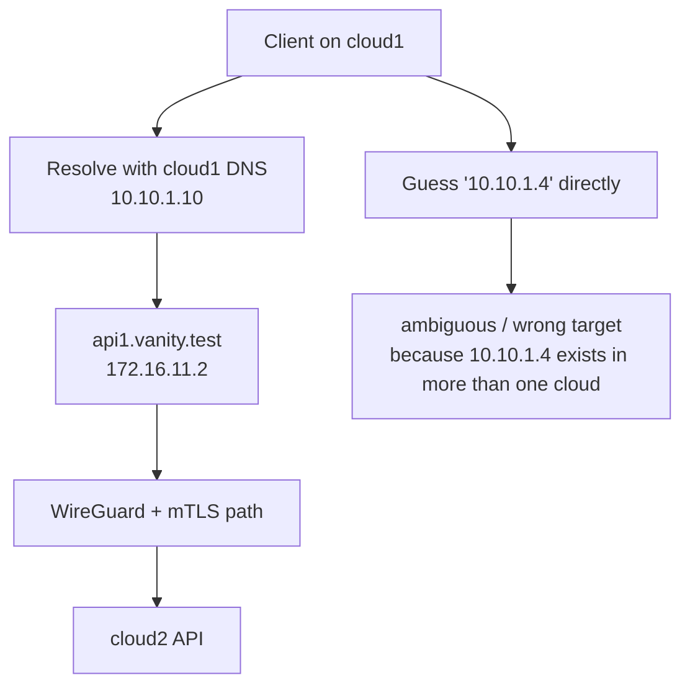

# Lima SD-WAN Lab

`sd-wan/lima` is the Lima-backed SD-WAN teaching lab, grouped outcome first and implementation second. It uses three macOS-hosted VMs to demonstrate overlapping address space, split-brain DNS, WireGuard transport, mTLS ingress, and a subnet-calculator workload.

The central idea is simple: private RFC1918 addresses are reused on purpose, so raw private IPs are not trustworthy cross-cloud identifiers. Resolver viewpoint and vanity names matter.

If you are new to the lab, read this page first, then [docs/what-is-sd-wan.md](docs/what-is-sd-wan.md), [docs/prerequisites.md](docs/prerequisites.md), and [docs/architecture.md](docs/architecture.md).

## Quick Start

Bring the lab up, print the browser URL, and then validate it:

```bash
make -C sd-wan/lima prereqs
make -C sd-wan/lima up
make -C sd-wan/lima show-urls
make -C sd-wan/lima test
```

What success looks like:

1. `make -C sd-wan/lima show-urls` prints `http://127.0.0.1:58081/`
1. opening that URL shows the subnet-calculator frontend on cloud1
1. after a lookup, the page shows both `Frontend Diagnostics (cloud1 viewpoint)` and `Backend Diagnostics (cloud2 viewpoint)`
1. those two panels show the same service being understood from two different places in the lab

Useful follow-ups:

```bash
make -C sd-wan/lima status
make -C sd-wan/lima logs
make -C sd-wan/lima down
make -C sd-wan/lima destroy
./sd-wan/lima/scripts/query-all-dns.sh
```

Rerunning `make -C sd-wan/lima up` is a supported repair path.

If the three lab VMs are already running, `up` now leaves them running and
re-applies the guest hostname and sync steps instead of issuing another VM
start. Use `make -C sd-wan/lima down` or `make -C sd-wan/lima destroy` when
you actually want a cold restart or a full teardown.

## What This Lab Teaches

- the same RFC1918 address can mean different things in different clouds
- different clouds can also use entirely different local numbering schemes
- the resolver you ask determines which private-world answer you get
- stable cross-cloud access uses service names, with a small `172.16.x.x` VIP space as the cross-cloud routable surface
- the WireGuard mesh is the transport, not the identity layer
- the Lima underlay is separate again, and only exists so the three guest "clouds" can find each other without becoming part of the SD-WAN identity model

## Topology









The intended cross-cloud path is always:

1. resolve from the cloud you are standing in
2. get back a `172.16.x.x` VIP
3. traverse the WireGuard mesh to that VIP
4. let the remote site decide how to reach its local RFC1918 workload

## Host Ports

The lab intentionally binds only the ports declared in the Lima templates:

- `127.0.0.1:58081` -> `cloud1:8080`

`make -C sd-wan/lima prereqs` validates those bindings before boot. The browser entrypoint stays on host localhost, and the Lima templates disable host-agent fallback auto-forwarding so the lab does not opportunistically claim ports like `:80` that Docker or other local workloads may already be using.

For guest-to-guest reachability, the VMs sit on Lima's named `user-v2` network and advertise their guest-underlay IPs into shared bring-up state under `/tmp/lima/wireguard`. That underlay is just VM plumbing. It is not the SD-WAN identity layer, and the docs intentionally treat its exact `192.168.x.x` numbering as an implementation detail rather than a service contract.

## Layout

- `cloud1.yaml`, `cloud2.yaml`, `cloud3.yaml` define the Lima VMs, their `user-v2` underlay, and the explicit localhost browser forward
- `provision/` contains the guest bootstrap scripts
- `config/` contains DNS, gateway, proxy, and SD-WAN configuration
- `tests/` contains shell checks and Makefile coverage
- `e2e/` contains Playwright coverage for the demo entrypoints
- `api/` and `html/` contain the demo workloads used on cloud3

## Supporting Docs

- [docs/README.md](docs/README.md) gives the reading order for the doc set.
- [docs/what-is-sd-wan.md](docs/what-is-sd-wan.md) explains the SD-WAN idea this lab is modelling.
- [docs/prerequisites.md](docs/prerequisites.md) explains the host-side checks and explicit Lima port contract.
- [docs/architecture.md](docs/architecture.md) shows how overlapping RFC1918 space, DNS, VIPs, and WireGuard fit together.
- [docs/network-verification.md](docs/network-verification.md) captures a worked verification run against the live mesh.
