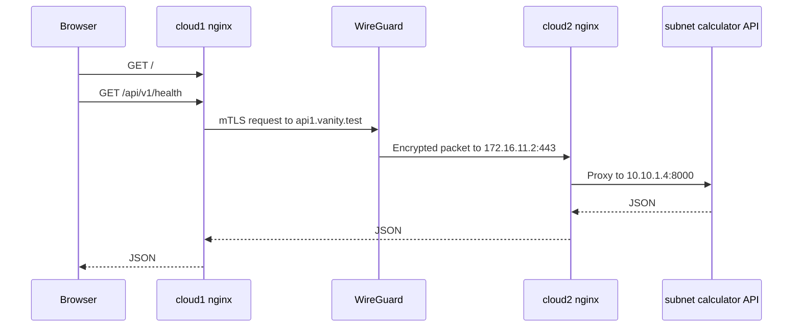
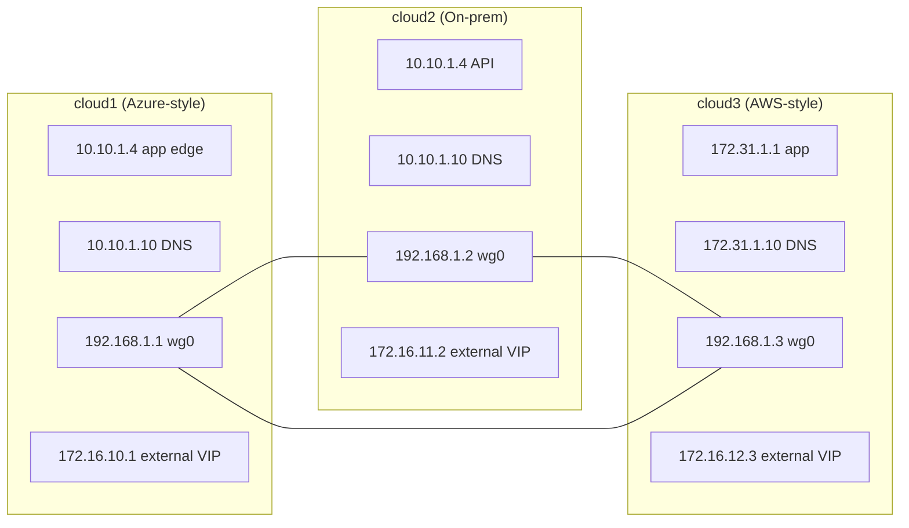
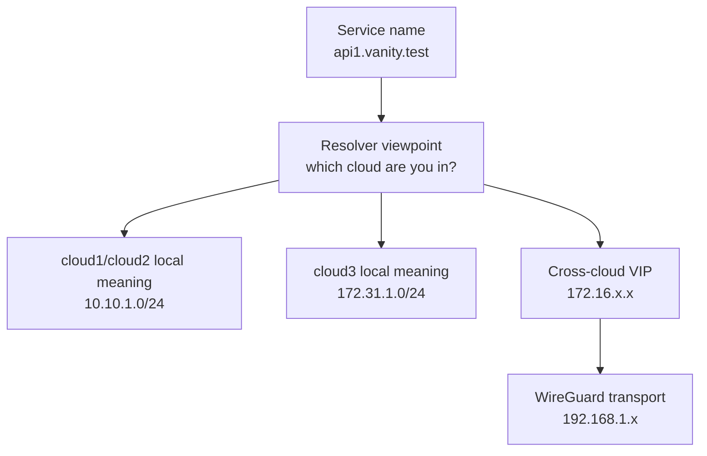
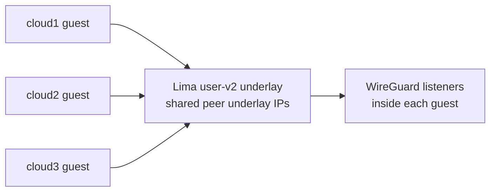
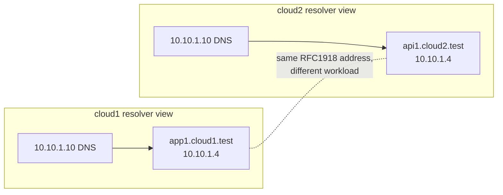
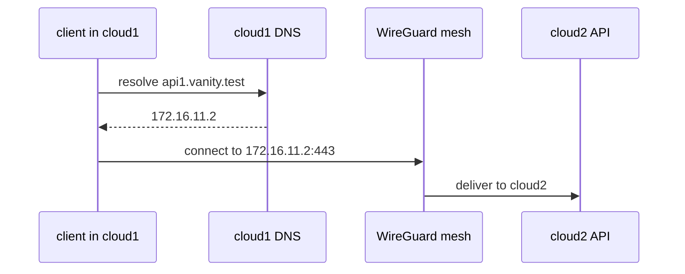
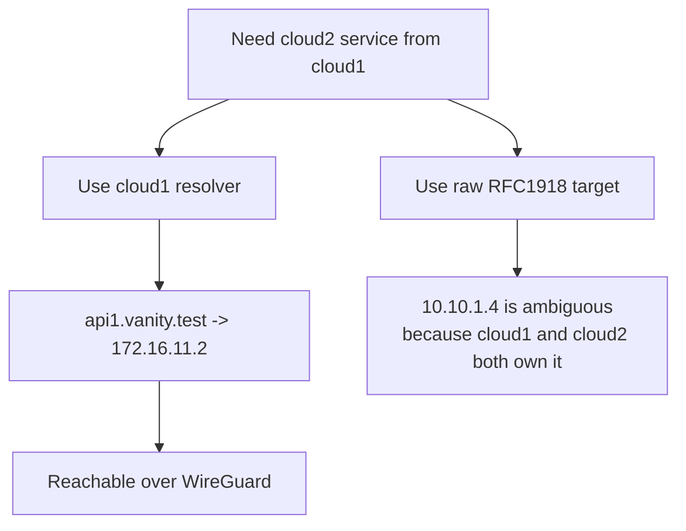

# Architecture

This document explains the lab shape, not just the mechanics. The important rule is that private RFC1918 space is reused on purpose, so names and resolver viewpoint matter more than raw private addresses.

Read this after [prerequisites.md](prerequisites.md) if you want to understand what the bring-up is creating, or after [what-is-sd-wan.md](what-is-sd-wan.md) if you want to move from concept into concrete topology.

## Outcome First

The repo layout is intentional:

- outcome: `sd-wan`
- implementation: `lima`

The point of the lab is the SD-WAN behavior. Lima is only the local VM substrate used to demonstrate it.

## Request Path

## Addressing Model

There are four different address roles in the lab, and they should not be conflated:

- cloud1 local service space: `10.10.1.0/24`
- cloud2 local service space: `10.10.1.0/24` again, on purpose
- cloud3 local service space: `172.31.1.0/24`
- cross-cloud VIP space: `172.16.10.0/24`, `172.16.11.0/24`, `172.16.12.0/24`
- WireGuard transport space: `192.168.1.0/24`
- Lima guest underlay: named `user-v2`, with each guest publishing its underlay IP into shared bring-up state

The Lima `user-v2` underlay is only there so the guests can find one another. It is not advertised in DNS, not used as a service identity, and not part of the `172.16.x.x` cross-cloud VIP layer.

## Overlap Is The Point

cloud1 and cloud2 both reuse `10.10.1.0/24`. That means an address like `10.10.1.4` is not globally meaningful by itself.

## Resolver Viewpoint Matters

The safe mental model is: resolve names from the cloud you are standing in, then cross clouds using the external VIP returned by that resolver.

## What To Remember

- `10.10.1.4` is local meaning, not global identity.
- the resolver you ask determines which private-world answer you get.
- cloud1 and cloud2 deliberately share one local numbering scheme, while cloud3 uses a different one.
- the `172.16.x.x` ranges are the small shared cross-cloud routable surface, not a replacement for names and resolver context.
- the Lima `user-v2` addresses are only guest-underlay plumbing for inter-VM reachability.
- cross-cloud traffic should use vanity names that resolve to `172.16.x.x` VIPs, not guessed RFC1918 addresses.
- the remote site can keep reusing its own RFC1918 space without that leaking into your routing intent.

## Workload Choice

The cloud2 API comes from `apps/subnetcalc/api-fastapi-container-app/app`. The cloud1 demo frontend is built from `apps/subnetcalc/frontend-typescript-vite`, with `apps/subnetcalc/shared-frontend` built first because the Vite frontend consumes its generated types.

Read next: [network-verification.md](network-verification.md) to see the same topology exercised with live DNS answers, WireGuard state, and end-to-end traffic.
