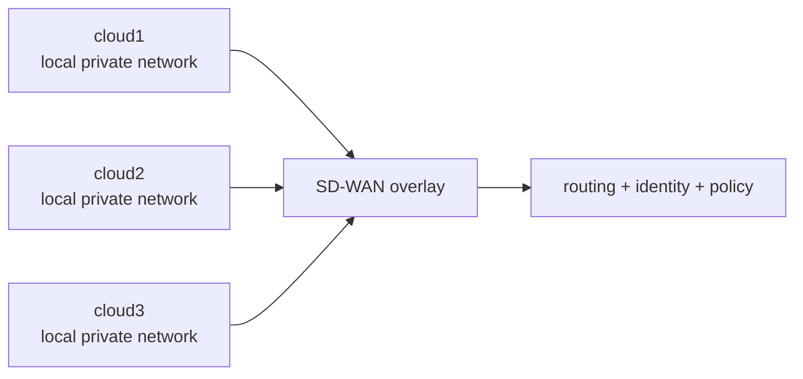
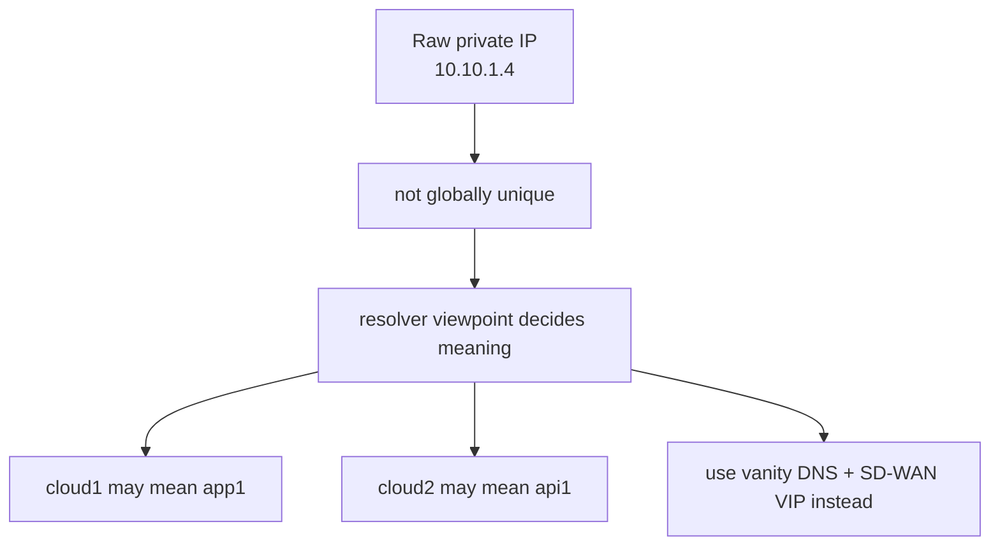

# What Is SD-WAN?

SD-WAN stands for **software-defined wide area network**.

Read this first if you want the concept before the lab mechanics. Then continue to [prerequisites.md](prerequisites.md) for host setup or [architecture.md](architecture.md) for the concrete address and resolver design.

The short version:

- a WAN links separate sites or clouds together
- SD-WAN adds software control over how those sites connect
- instead of treating each site as an isolated network island, it creates a managed overlay with policy, routing intent, and stable service paths

This lab uses that idea in a deliberately uncomfortable way: it reuses private address space across clouds so the overlay identity layer becomes necessary rather than optional.

## In This Lab

This lab uses WireGuard as the transport, but the point is not "WireGuard by itself". The point is the SD-WAN outcome:

- three separate sites
- overlapping private address space
- controlled cross-site routing
- stable external identities for services
- policy over which path traffic should take

## Why It Helps

Without an SD-WAN-style overlay, each site mostly has to reason about its own local network and whatever brittle point-to-point links happen to exist.

With SD-WAN, you aim for:

- predictable site-to-site connectivity
- service identities that survive private IP reuse
- central intent about which networks are reachable
- less dependence on raw underlay topology

## Why RFC1918 Reuse Matters Here

This repo intentionally mixes different numbering schemes across the three clouds:

- cloud1 uses `10.10.1.0/24`
- cloud2 also uses `10.10.1.0/24`
- cloud3 uses `172.31.1.0/24`
- a smaller `172.16.10.0/24`, `172.16.11.0/24`, `172.16.12.0/24` space is reserved for cross-cloud reachable VIPs
- `192.168.1.0/24` is the WireGuard transport-only range
- Lima `user-v2` provides guest-underlay reachability between the three VM sites, with peer underlay IPs exchanged during bring-up

That is the teaching point. A raw RFC1918 address is not enough. You need resolver context and an overlay identity model.

## Mental Model

- underlay: the actual local networks and host connectivity
- overlay: the SD-WAN path that sits on top
- identity: the service name you mean, interpreted from the resolver viewpoint you are standing in
- policy: which destinations are allowed and how traffic should traverse the mesh

In this lab:

- underlay is provided by the Lima VMs and their local site networks
- overlay is the WireGuard mesh
- identity starts as the service name, and DNS maps that intent onto either a cloud-local address or a cross-cloud VIP as needed
- `172.16.x.x` is the cross-cloud routable VIP space, not the full identity model by itself
- `192.168.1.x` is transport plumbing for WireGuard, not application addressing
- Lima `user-v2` is VM-underlay plumbing for reachability, not SD-WAN identity or transport addressing inside the overlay
- policy is expressed by DNS answers, tunnel routes, and iptables rules

Read next: [prerequisites.md](prerequisites.md) for the host-side bring-up contract, or [architecture.md](architecture.md) for the cloud-by-cloud diagrams.
