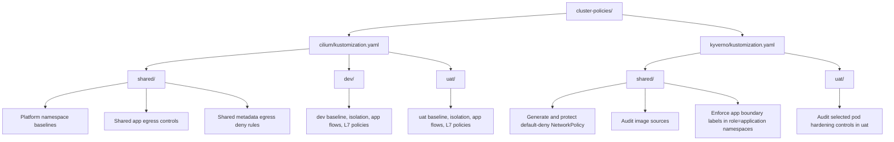
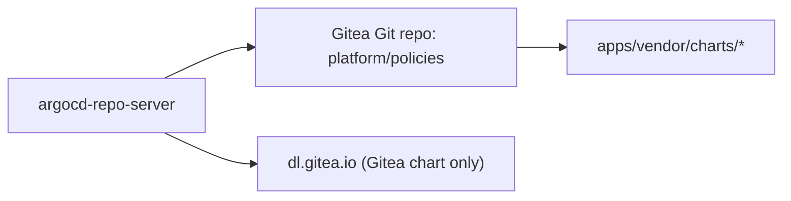
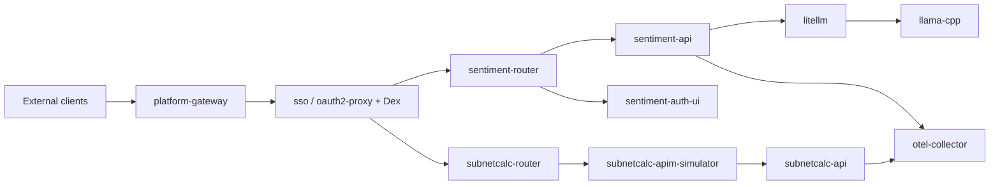

# Cluster Policy Audit

This document audits the active policy set under `terraform/kubernetes/cluster-policies/` after the selector and enforcement fixes on branch `codex/cluster-policy-audit`.

Related views:

- `COMPOSITION.md` shows which source files are rendered by the active Kustomize trees.
- `../docs/apps-c4.md` shows the static application and policy control model for `sentiment` and `subnetcalc`.

## Current posture

- The Cilium app-flow policies are now workload-scoped instead of project-scoped, so router, API, frontend, LiteLLM, and llama.cpp permissions are separated by actual workload identity.
- `protect-default-deny-netpol` now enforces deletion protection instead of only reporting it.
- `require-app-labels-application-namespaces` now validates both `Deployment` labels and pod-template labels, and it enforces those checks in any namespace labeled `role=application`.
- Namespace intent is now explicit: `dev` and `uat` carry `role=application`, while supporting namespaces such as `apim`, `sso`, `observability`, `gitea`, and `headlamp` carry `role=shared`.
- The stale Kyverno `dev` topology-spread overlay was removed from composition because it no longer matched the deployed namespace layout.
- Non-Gitea external Helm charts are now vendored into the in-cluster `platform/policies` Git repository, so Argo CD renders those apps from Gitea Git instead of public Helm repos.
- `argocd-repo-server` external Helm egress is now reduced to the remaining bootstrap dependency on `dl.gitea.io:443` for the Gitea chart itself.
- The live Cloudflare range fetch path is now `dev`-only and exact-host scoped to `www.cloudflare.com:443`; `uat` intentionally uses the API's fallback ranges.
- Cilium FQDN policies in this tree now carry DNS L7 rules so hostname-based egress actually has DNS visibility to enforce against.

## Composition

## Active inventory

### Cilium shared

| Policy | Purpose | Notes |
| --- | --- | --- |
| `approved-egress-cidrs.yaml` | Reusable CIDR group for approved external HTTPS IPs. | Centralized, but IP allowlists are coarse for internet destinations. |
| `deny-cloud-metadata-egress.yaml` | Blocks metadata endpoints from `dev`, `uat`, and `apim`. | Good defense-in-depth baseline. |
| `deny-cloud-metadata-dev-uat-apps.yaml` | Blocks IMDS for selected app pods in `dev` and `uat`. | Overlaps with the broader metadata deny. |
| `allow-dev-uat-apps-egress-via-cidrgroup.yaml` | Allows selected app backends to the approved CIDR group on 443 plus DNS. | Narrower than before because frontends and gateways no longer inherit the shared outbound rule. |
| `allow-dev-uat-apps-egress-via-fqdn.yaml` | Allows those same app backends to GitHub API and GitHub content over 443. | Now includes a DNS L7 rule so the FQDN pinning is actually enforceable, and frontends/gateways are excluded from the shared outbound rule. |
| `sentiment-api-dns-egress.yaml` | Allows DNS for sentiment backend and LLM workloads in `dev` and `uat`. | Good narrow helper policy. |
| `sentiment-llama-cpp-world-egress.yaml` | Allows llama.cpp to fetch model artifacts over HTTP and HTTPS. | Broad `world` access remains a tradeoff. |
| `apim-baseline.yaml` | Restricts APIM ingress to subnetcalc routers and egress to Dex, subnetcalc API, DNS, and apiserver. | Strong dedicated namespace baseline. |
| `argocd-hardened.yaml` | Restricts Argo CD ingress and baseline egress to Gitea, Dex, DNS, and the apiserver. | External chart fetches are now moved out of the namespace-wide policy. |
| `argocd-hardened.yaml` (`argocd-repo-server-helm-egress`) | Allows only `argocd-repo-server` to reach `dl.gitea.io:443`. | This is now a minimal bootstrap exception for the Gitea chart; other chart-based apps render from vendored charts in Gitea Git. The rule now includes DNS L7 visibility so the FQDN pin is active. |
| `azure-auth-nginx-gateway-ingress.yaml` | Restricts the nginx-gateway control plane to host, platform-gateway, DNS, and apiserver traffic. | Good control-plane hardening. |
| `observability-hardened.yaml` | Restricts ingest and scraping paths for observability workloads. | Mostly strong; host `10255` remains the main questionable allowance. |
| `platform-baseline.yaml` | Hardens Headlamp ingress and its egress to apiserver, Dex, platform-gateway, DNS, and plugin registries. | Good overall structure; the plugin-registry FQDN allow now has DNS proxy visibility in the same policy. |
| `platform-gateway-hardened.yaml` | Defines the external ingress choke point and its internal egress targets. | Strong boundary placement. |
| `sso-hardened.yaml` | Hardens Dex and oauth2-proxy workloads and limits oauth2-proxy upstreams. | Improved: app egress to `dev` and `uat` is now narrowed to the two routers. |
| `gitea-hardened.yaml` | Restricts Gitea namespace ingress and egress. | Good namespace isolation. |
| `gitea-runner-hardened.yaml` | Restricts runner ingress and egress to Gitea, apiserver, DNS, and host port `30090`. | Reasonable for this runner model. |

### Cilium dev and uat overlays

| Policy set | Purpose | Notes |
| --- | --- | --- |
| `dev-baseline.yaml` and `uat-baseline.yaml` | Namespace-wide baseline: health-probe ingress plus DNS and apiserver egress. | Correct additive-policy baseline. |
| `dev-project-isolation.yaml` and `uat-project-isolation.yaml` | Symmetric deny rules between the `sentiment-llm` and `subnetcalc` app boundaries within a namespace. | Strong explicit isolation keyed off the shared `project/team/app` labels. |
| `dev-mtls-sentiment.yaml` and `uat-mtls-sentiment.yaml` | Workload-scoped L4 policy set for sentiment router, API, frontend, LiteLLM, and llama.cpp. | This was the main structural fix in the branch. |
| `dev-mtls-subnetcalc.yaml` and `uat-mtls-subnetcalc.yaml` | Workload-scoped ingress policy set for subnetcalc router and frontend. | Keeps router ingress and frontend reachability tight while L7 policies handle router and API paths. |
| `dev-subnetcalc-api-cloudflare-egress.yaml` | Allows only the dev subnetcalc API to fetch the live Cloudflare range files from `www.cloudflare.com:443`. | Intentional environment split: dev exercises the live lookup path, uat uses the API's fallback ranges. This rule is now exact-host scoped and uses a DNS L7 rule instead of a Cloudflare CIDR assist. |
| `sentiment-router-l7-dev.yaml` and `sentiment-router-l7-uat.yaml` | Restrict router egress to allowed sentiment API methods and paths. | Useful L7 defense on the API surface. |
| `subnetcalc-l7-dev.yaml` and `subnetcalc-l7-uat.yaml` | Restrict subnetcalc router egress to approved APIM paths and restrict subnetcalc API ingress to APIM. | Strongest request-path modeling in the tree. |

### Kyverno

| Policy | Purpose | Notes |
| --- | --- | --- |
| `shared/namespace-default-deny.yaml` | Generates a `default-deny` `NetworkPolicy` for namespaces labeled `kyverno.io/isolate=true`. | Valid scaffold; the label is defined in Terraform-managed namespaces. |
| `shared/protect-default-deny.yaml` | Blocks deletion of generated `default-deny` policies in isolated namespaces. | Now enforced instead of audit-only. |
| `shared/restrict-image-registries.yaml` | Audits image sources in selected namespaces against an allowlist. | Still audit-only and intentionally broad. |
| `shared/require-app-labels-application-namespaces.yaml` | Enforces `app`, `tier`, `project=kindlocal`, and `team=dolphin` on both the `Deployment` object and its pod template in any namespace labeled `role=application`. | This decouples label enforcement from the current `dev`/`uat` namespace names and makes `sit`/`pat` style expansion straightforward. |
| `uat/uat-restrict-capabilities.yaml` | Audits dropped capabilities, non-privileged execution, and disabled host namespaces for pods in `uat`. | Still partial restricted-profile coverage and still audit-only. |

## Mode-dependent files

- `cilium/shared/sentiment-api-llm-egress.yaml` exists on disk but is not part of the current rendered set in the default LiteLLM mode.
- In direct mode, `terraform/kubernetes/scripts/sync-gitea-policies.sh` now renders that policy to a specific `/32` derived from `LLM_GATEWAY_EXTERNAL_NAME` or `LLM_GATEWAY_EXTERNAL_CIDR`.
- `terraform/kubernetes/scripts/sync-gitea-policies.sh` adds or removes that file from `cilium/shared/kustomization.yaml` based on `LLM_GATEWAY_MODE`, so this is conditional composition rather than dead drift.

## What changed in this branch

1. Split the `dev-mtls-*` and `uat-mtls-*` Cilium policies into workload-specific selectors so the app stacks no longer inherit project-wide unions of allows.
2. Narrowed `sso-hardened.yaml` egress to the app routers in `dev` and `uat` instead of the entire namespaces.
3. Changed `protect-default-deny.yaml` from `Audit` to `Enforce`.
4. Replaced the old UAT-only label check with `shared/require-app-labels-application-namespaces.yaml`, which enforces pod-template labels as well as deployment labels in any namespace labeled `role=application`.
5. Removed the stale Kyverno `dev` overlay and its obsolete topology-spread mutation from the active policy set.
6. Vendored non-Gitea Helm charts into the Gitea-backed `platform/policies` repo and repointed Argo `Application` sources at `apps/vendor/charts/*`.
7. Tightened the repo-server external egress exception from a multi-host Helm allowlist to `dl.gitea.io:443` only.
8. Updated `terraform/kubernetes/scripts/check-version.sh` so vendored Argo apps report deployed chart versions from live `helm.sh/chart` labels instead of nonexistent Helm release records.
9. Removed the Cloudflare CIDR assist and converted the dev-only subnetcalc live-fetch path to exact-host `www.cloudflare.com` with DNS proxy visibility, while keeping `uat` on fallback behavior.

## Remaining gaps

These are the main best-practice gaps that still remain after the fixes above:

1. `shared/restrict-image-registries.yaml` is still audit-only and uses broad wildcard patterns. It is useful for visibility, but it is not a production-grade allowlist yet.
2. `uat/uat-restrict-capabilities.yaml` is still audit-only and only covers a subset of Pod Security restricted controls. It does not cover `allowPrivilegeEscalation`, seccomp, `runAsNonRoot`, init containers, or ephemeral containers.
3. `sentiment-llama-cpp-world-egress.yaml` still allows `world` on `80/443`. That may still be necessary for model downloads, but it remains broader than strict least privilege and is not exercised in the current direct-gateway live cluster mode.
4. `allow-dev-uat-apps-egress-via-cidrgroup.yaml` and `allow-dev-uat-apps-egress-via-fqdn.yaml` are now limited to app backends, but they still represent shared outbound access for more than one workload and may still deserve further per-app tightening.
5. `observability-hardened.yaml` still allows host and remote-node access on TCP `10255`. That port should stay justified or be removed.
6. The last public Helm dependency is still the Gitea bootstrap chart. Removing that final exception would require vendoring or otherwise prehosting the Gitea chart before Gitea itself exists.

## Verification

- `kubectl kustomize terraform/kubernetes/cluster-policies/cilium` renders successfully after the selector refactor.
- `kubectl kustomize terraform/kubernetes/cluster-policies/kyverno` renders successfully after removing the stale `dev` overlay.
- `bats kubernetes/kind/tests/cilium-fqdn-policies.bats` passes, proving the rendered set no longer includes the shared Cloudflare policy, that the dev policy is exact-host only, and that every FQDN policy carries a DNS proxy rule.
- `make -C kubernetes/kind reset AUTO_APPROVE=1` followed by `make -C kubernetes/kind 900 apply AUTO_APPROVE=1` succeeded on March 11, 2026, proving the vendored-chart GitOps flow from a clean kind cluster.
- Live `argocd-repo-server` logs on March 11, 2026 showed Git-backed manifest generation for vendored charts and only `dl.gitea.io` among the remaining public Helm endpoints.
- `terraform/kubernetes/scripts/check-version.sh` now reports deployed chart versions for Argo-managed vendored apps such as Gitea, Prometheus, and Policy Reporter by inspecting live `helm.sh/chart` labels.
- Live testing on March 12, 2026 showed `dev/subnetcalc-api` successfully fetching `https://www.cloudflare.com/ips-v4/` with exact-host FQDN policy plus DNS L7 support, while `uat/subnetcalc-api` continued to report fallback range usage.
