# Cluster Policy Audit

This document audits the active policy set under `terraform/kubernetes/cluster-policies/` after the selector, inheritance, and namespace-overlay refactors on branch `codex/cluster-policy-audit`.

Related views:

- `COMPOSITION.md` shows which source files are rendered by the active Kustomize trees.
- `../docs/apps-c4.md` shows the static application and policy control model for `sentiment` and `subnetcalc`.

GitHub currently renders these Mermaid views with a transparent canvas in a way
that makes the diagrams harder to read, so the diagrams below are checked-in
SVG renders. Click any diagram to open its `.mmd` source.

## Current posture

- The Cilium model is now split between clusterwide guardrails in `cilium/shared/` and reusable namespaced `CiliumNetworkPolicy` bundles in `cilium/projects/`, so router, API, frontend, and the optional legacy LiteLLM and llama.cpp permissions are separated by actual workload identity without duplicating the same YAML per namespace.
- The shipped stages now default `sentiment` to in-process SST inside `sentiment-api`; the legacy direct host-backed and in-cluster LiteLLM branches remain available as opt-in modes.
- `protect-default-deny-netpol` now enforces deletion protection instead of only reporting it.
- `require-app-labels-application-namespaces` now validates both `Deployment` labels and pod-template labels, and it enforces those checks in any namespace labeled `platform.publiccloudexperiments.net/namespace-role=application`.
- Namespace intent is now explicit: `dev`, `uat`, and the intentionally empty `sit` namespace carry `platform.publiccloudexperiments.net/namespace-role=application` plus `platform.publiccloudexperiments.net/environment`; serving-path and runtime shared-service namespaces such as `apim`, `sso`, `observability`, `platform-gateway`, and `gateway-routes` carry `platform.publiccloudexperiments.net/namespace-role=shared`; and operator, control, and delivery namespaces such as `argocd`, `cert-manager`, `kyverno`, `nginx-gateway`, `gitea`, `gitea-runner`, `headlamp`, and `policy-reporter` carry `platform.publiccloudexperiments.net/namespace-role=platform`.
- Namespace sensitivity labels now use `platform.publiccloudexperiments.net/sensitivity=private|confidential|restricted`, following the [SISA Infosec data classification model](https://www.sisainfosec.com/blogs/data-classification-levels/).
- The stale Kyverno `dev` topology-spread overlay was removed from composition because it no longer matched the deployed namespace layout.
- Non-Gitea external Helm charts are now vendored into the in-cluster `platform/policies` Git repository, so Argo CD renders those apps from Gitea Git instead of public Helm repos.
- `argocd-repo-server` external Helm egress is now reduced to the remaining bootstrap dependency on `dl.gitea.io:443` for the Gitea chart itself.
- The live Cloudflare range fetch path is now a namespace-local override in `dev/overrides/`, exact-host scoped to `www.cloudflare.com:443`; `uat` and `sit` intentionally use the API's fallback ranges.
- Cilium FQDN policies in this tree now carry DNS L7 rules so hostname-based egress actually has DNS visibility to enforce against.
- The intentionally empty `sit` namespace now renders the same reusable Cilium project bundles as `dev` and `uat`, proving policy inheritance before workloads land there.

## Composition

## Active inventory

### Cilium shared guardrails

| Policy | Purpose | Notes |
| --- | --- | --- |
| `approved-egress-cidrs.yaml` | Reusable CIDR group for approved external HTTPS IPs. | Centralized, but IP allowlists are coarse for internet destinations. |
| `deny-cloud-metadata-egress.yaml` | Blocks metadata endpoints from `dev`, `uat`, and `apim`. | Good defense-in-depth baseline. |
| `application-baseline.yaml` | Provides the baseline application-namespace allowlist: health probes in, DNS and apiserver out. | Replaces the old duplicated `dev`/`uat` baselines. |
| `application-project-boundaries.yaml` | Denies `sentiment` to `subnetcalc` and the reverse across all application namespaces. | Strong shared guardrail keyed off the common `project/team/app` labels. |
| `application-cloud-metadata-deny.yaml` | Blocks IMDS for application pods with frontend/gateway/backend tiers. | Cleaner shared intent than the old `dev`/`uat`-named file. |
| `application-backend-egress-via-cidrgroup.yaml` | Allows selected app backends to the approved CIDR group on 443 plus DNS. | Narrower than before because frontends and gateways no longer inherit the shared outbound rule. |
| `application-backend-egress-via-fqdn.yaml` | Allows those same app backends to GitHub API and GitHub content over 443. | Includes DNS L7 visibility so the FQDN pinning is actually enforceable. |
| `sentiment-api-dns-egress.yaml` | Allows DNS for sentiment backend and legacy LLM workloads in application namespaces. | Mostly relevant when a non-default sentiment backend mode needs DNS visibility. |
| `sentiment-llama-cpp-world-egress.yaml` | Allows llama.cpp to fetch model artifacts over HTTP and HTTPS. | Broad `world` access remains a tradeoff. |
| `apim-baseline.yaml` | Restricts APIM ingress to subnetcalc routers and egress to Dex, subnetcalc API, DNS, and apiserver. | Now keys off `namespace-role=application` for inherited subnetcalc deployments. |
| `argocd-hardened.yaml` | Restricts Argo CD ingress and baseline egress to Gitea, Dex, DNS, and the apiserver. | External chart fetches are now moved out of the namespace-wide policy. |
| `argocd-hardened.yaml` (`argocd-repo-server-helm-egress`) | Allows only `argocd-repo-server` to reach `dl.gitea.io:443`. | This is now a minimal bootstrap exception for the Gitea chart; other chart-based apps render from vendored charts in Gitea Git. The rule now includes DNS L7 visibility so the FQDN pin is active. |
| `azure-auth-nginx-gateway-ingress.yaml` | Restricts the nginx-gateway control plane to host, platform-gateway, DNS, and apiserver traffic. | Good control-plane hardening. |
| `observability-hardened.yaml` | Restricts ingest and scraping paths for observability workloads. | Now accepts OTEL traffic from any application namespace; host `10255` remains the main questionable allowance. |
| `platform-baseline.yaml` | Hardens Headlamp ingress and its egress to apiserver, Dex, platform-gateway, DNS, and plugin registries. | Good overall structure; the plugin-registry FQDN allow now has DNS proxy visibility in the same policy. |
| `platform-gateway-hardened.yaml` | Defines the external ingress choke point and its internal egress targets. | Strong boundary placement. |
| `sso-hardened.yaml` | Hardens Dex and oauth2-proxy workloads and limits oauth2-proxy upstreams. | Improved: app ingress and router upstreams now key off `namespace-role=application` instead of hardcoded `dev`/`uat`. |
| `gitea-hardened.yaml` | Restricts Gitea namespace ingress and egress. | Good namespace isolation. |
| `gitea-runner-hardened.yaml` | Restricts runner ingress and egress to Gitea, apiserver, DNS, and host port `30090`. | Reasonable for this runner model. |

### Reusable app bundles and namespace overlays

| Policy set | Purpose | Notes |
| --- | --- | --- |
| `projects/sentiment/sentiment-runtime.yaml` | Reusable namespaced runtime policy set for sentiment router, API, frontend, plus the optional legacy LiteLLM and llama.cpp path. | Rendered as `CiliumNetworkPolicy` into `dev`, `uat`, and `sit`. |
| `projects/sentiment/sentiment-http-routes.yaml` | Restricts router egress to allowed sentiment API methods and paths. | Useful L7 defense on the API surface. |
| `projects/subnetcalc/subnetcalc-runtime.yaml` | Reusable namespaced ingress policy set for subnetcalc router and frontend. | Keeps router ingress and frontend reachability tight while L7 policies handle router and API paths. |
| `projects/subnetcalc/subnetcalc-http-routes.yaml` | Restricts subnetcalc router egress to approved APIM paths and restricts subnetcalc API ingress to APIM. | Strongest request-path modeling in the tree. |
| `dev/overrides/subnetcalc-cloudflare-live-fetch.yaml` | Allows only the dev subnetcalc API to fetch the live Cloudflare range files from `www.cloudflare.com:443`. | This is the reference pattern for a project team's namespace-local override. |
| `dev/`, `uat/`, `sit/` overlays | Apply the reusable app bundles into concrete namespaces. | `sit` stays empty today but proves the inherited render shape. |

### Kyverno

| Policy | Purpose | Notes |
| --- | --- | --- |
| `shared/namespace-default-deny.yaml` | Generates a `default-deny` `NetworkPolicy` for namespaces labeled `kyverno.io/isolate=true`. | Valid scaffold; the label is defined in Terraform-managed namespaces. |
| `shared/protect-default-deny.yaml` | Blocks deletion of generated `default-deny` policies in isolated namespaces. | Now enforced instead of audit-only. |
| `shared/restrict-image-registries.yaml` | Audits image sources in selected namespaces against an allowlist. | Still audit-only and intentionally broad. |
| `shared/require-app-labels-application-namespaces.yaml` | Enforces `app`, `tier`, `project=kindlocal`, and `team=dolphin` on both the `Deployment` object and its pod template in any namespace labeled `platform.publiccloudexperiments.net/namespace-role=application`. | This decouples label enforcement from the current `dev`/`uat` workload namespaces and is now live-proven by the empty `sit` namespace as well. |
| `uat/uat-restrict-capabilities.yaml` | Audits dropped capabilities, non-privileged execution, and disabled host namespaces for pods in `uat`. | Still partial restricted-profile coverage and still audit-only. |

## Mode-dependent files

- `cilium/shared/sentiment-api-llm-egress.yaml` exists on disk but is not part of the shipped default SST mode.
- In direct mode, `terraform/kubernetes/scripts/sync-gitea-policies.sh` now renders that policy to a specific `/32` derived from `LLM_GATEWAY_EXTERNAL_NAME` or `LLM_GATEWAY_EXTERNAL_CIDR`.
- `terraform/kubernetes/scripts/sync-gitea-policies.sh` adds or removes that file from `cilium/shared/kustomization.yaml` based on `LLM_GATEWAY_MODE`, so this is conditional composition rather than dead drift.

## What changed in this branch

1. Reworked the Cilium tree into clusterwide guardrails plus reusable namespaced project bundles so `dev`, `uat`, and `sit` can share the same app-flow policies without copying environment names into every selector.
2. Added explicit namespace overlay `overrides/` directories so a team can keep a namespace-local exception, such as the dev-only Cloudflare fetch, alongside the namespace that owns it.
3. Narrowed `sso-hardened.yaml`, `apim-baseline.yaml`, and `observability-hardened.yaml` to key off `namespace-role=application` where that is the actual intent, instead of hardcoded `dev`/`uat` namespace names.
4. Changed `protect-default-deny.yaml` from `Audit` to `Enforce`.
5. Replaced the old UAT-only label check with `shared/require-app-labels-application-namespaces.yaml`, which enforces pod-template labels as well as deployment labels in any namespace labeled `platform.publiccloudexperiments.net/namespace-role=application`.
6. Removed the stale Kyverno `dev` overlay and its obsolete topology-spread mutation from the active policy set.
7. Vendored non-Gitea Helm charts into the Gitea-backed `platform/policies` repo and repointed Argo `Application` sources at `apps/vendor/charts/*`.
8. Tightened the repo-server external egress exception from a multi-host Helm allowlist to `dl.gitea.io:443` only.
9. Updated `terraform/kubernetes/scripts/check-version.sh` so vendored Argo apps report deployed chart versions from live `helm.sh/chart` labels instead of nonexistent Helm release records.
10. Removed the Cloudflare CIDR assist and converted the dev-only subnetcalc live-fetch path to exact-host `www.cloudflare.com` with DNS proxy visibility, while keeping `uat` on fallback behavior.
11. Reworked namespace metadata from a two-way `application/shared` split to a three-way `application/shared/platform` taxonomy, replaced the old `security-tier` wording with `platform.publiccloudexperiments.net/sensitivity`, and added an empty `sit` application namespace to prove namespace-level inheritance without deploying workloads there.

## Remaining gaps

These are the main best-practice gaps that still remain after the fixes above:

1. `shared/restrict-image-registries.yaml` is still audit-only and uses broad wildcard patterns. It is useful for visibility, but it is not a production-grade allowlist yet.
2. `uat/uat-restrict-capabilities.yaml` is still audit-only and only covers a subset of Pod Security restricted controls. It does not cover `allowPrivilegeEscalation`, seccomp, `runAsNonRoot`, init containers, or ephemeral containers.
3. `sentiment-llama-cpp-world-egress.yaml` still allows `world` on `80/443`. That may still be necessary for legacy in-cluster model downloads, but it remains broader than strict least privilege and is not exercised in the shipped SST path.
4. `application-backend-egress-via-cidrgroup.yaml` and `application-backend-egress-via-fqdn.yaml` are limited to app backends, but they still represent shared outbound access for more than one workload and may still deserve further per-app tightening.
5. `observability-hardened.yaml` still allows host and remote-node access on TCP `10255`. That port should stay justified or be removed.
6. The last public Helm dependency is still the Gitea bootstrap chart. Removing that final exception would require vendoring or otherwise prehosting the Gitea chart before Gitea itself exists.

## Verification

- `kubectl kustomize terraform/kubernetes/cluster-policies/cilium` renders successfully after the selector refactor.
- `kubectl kustomize terraform/kubernetes/cluster-policies/kyverno` renders successfully after removing the stale `dev` overlay.
- `bats kubernetes/kind/tests/cilium-fqdn-policies.bats` passes, proving the rendered set no longer includes the shared Cloudflare policy, that the dev policy is exact-host only, and that every FQDN policy carries a DNS proxy rule.
- `bats kubernetes/kind/tests/platform-gateway-tls.bats` passes, proving the checked-in gateway manifests keep `SnippetsPolicy` support, TLS 1.2/1.3 listener options, and the expected hardening directives.
- `make -C kubernetes/kind reset AUTO_APPROVE=1` followed by `make -C kubernetes/kind 900 apply AUTO_APPROVE=1` succeeded on March 11, 2026, proving the vendored-chart GitOps flow from a clean kind cluster.
- Live `argocd-repo-server` logs on March 11, 2026 showed Git-backed manifest generation for vendored charts and only `dl.gitea.io` among the remaining public Helm endpoints.
- `terraform/kubernetes/scripts/check-version.sh` now reports deployed chart versions for Argo-managed vendored apps such as Gitea, Prometheus, and Policy Reporter by inspecting live `helm.sh/chart` labels.
- Live testing on March 12, 2026 showed `dev/subnetcalc-api` successfully fetching `https://www.cloudflare.com/ips-v4/` with exact-host FQDN policy plus DNS L7 support, while `uat/subnetcalc-api` continued to report fallback range usage.
- Live testing on March 19, 2026 showed the platform gateway accepting TLS 1.2 and TLS 1.3 on the host-facing path, serving HSTS and `X-Content-Type-Options: nosniff`, and rendering every directive from `apps/platform-gateway/tls-hardening.yaml` into the NGINX config tree.
- Live testing on March 12, 2026 showed the empty `sit` namespace present with `platform.publiccloudexperiments.net/namespace-role=application`, `platform.publiccloudexperiments.net/environment=sit`, `kyverno.io/isolate=true`, and a generated `default-deny` `NetworkPolicy`, proving the namespace-level Kyverno defaults are no longer coupled to `dev` and `uat` alone.
