# Sentiment And Subnetcalc Architecture Views

This document is a static reasoning aid for the two demo applications and the
policies that constrain them. It complements Hubble and the Cilium UI by
showing the intended design before traffic is observed.

Scope:

- stage `900` style flow, with SSO enabled
- current shipped kind default for sentiment: in-process SST mode
- both `dev` and `uat`, with the key intentional split called out explicitly

## Reading Guide

- The document now mixes Mermaid C4, UML state diagrams, and sequence diagrams
  on purpose. Different questions are easier to answer in different notations.
- Edge labels call out the main controller for the hop: Cilium policy, app
  config, or application fallback logic.
- `dev` and `uat` usually share the same request path; the Cloudflare live
  fetch is the main deliberate exception.
- The C4 views show structure and control boundaries; the UML state views show
  how requests and background jobs move through the system; the sequence
  diagrams later in the document show handshake and request-flow behavior.
- Dynamic C4 views are split into focused paths because Mermaid C4 beta is much
  better at ordered interactions than at `alt` / `else` branching.

GitHub currently renders these Mermaid views with a transparent canvas in a way
that makes the C4 diagrams hard to read, so each diagram below is a checked-in
SVG render. Click any diagram to open its `.mmd` source.

## System Context

[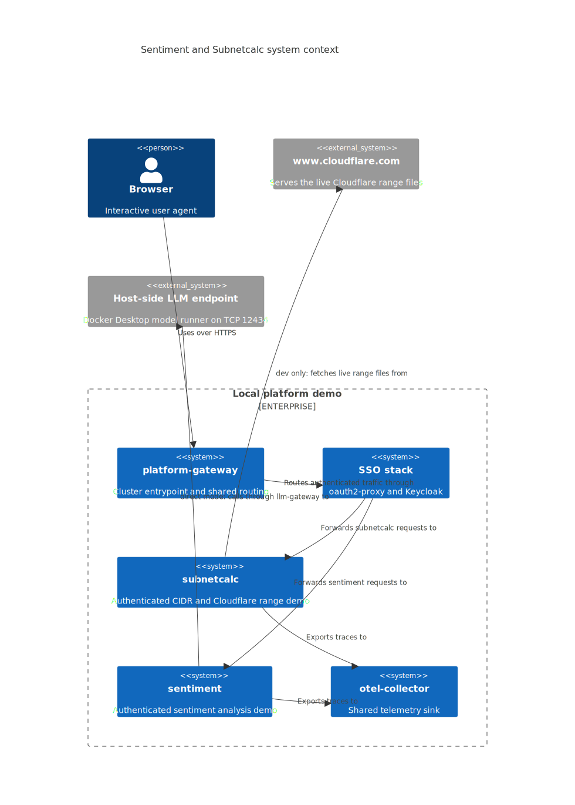](./diagrams/apps-c4/01-system-context.mmd)

## Container View

### Subnetcalc

[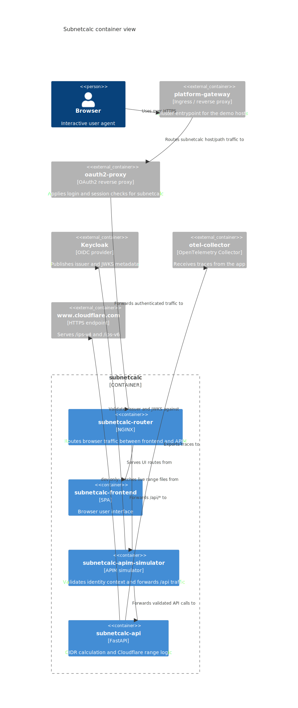](./diagrams/apps-c4/02-container-subnetcalc.mmd)

Key intent:

- the router never talks to `subnetcalc-api` directly
- `/api/*` traffic always crosses the APIM simulator first
- only `dev` may fetch live Cloudflare range files; `uat` falls back in code

### Sentiment

[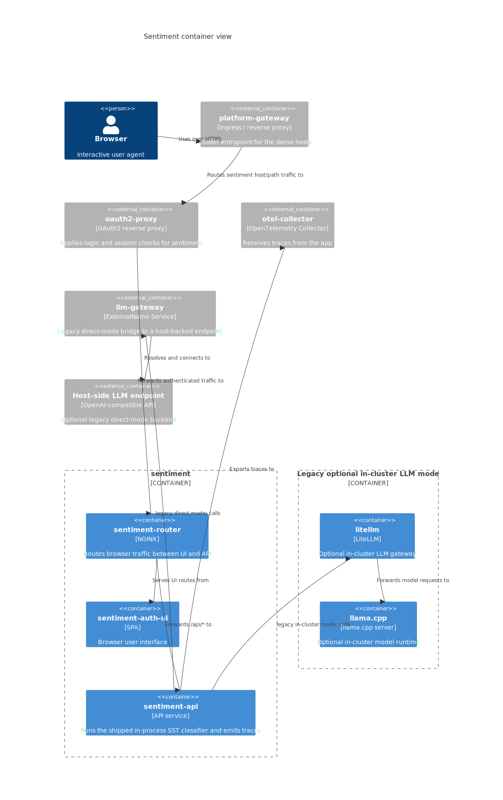](./diagrams/apps-c4/03-container-sentiment.mmd)

Key intent:

- the router splits browser traffic between UI and API
- the shipped default keeps sentiment classification inside `sentiment-api`
  with an in-process SST model
- the repo still contains legacy direct host-backed and in-cluster LiteLLM
  plus `llama.cpp` modes, but those are not the default selected by the
  checked-in kind stages

## UML State Views

These use Mermaid's UML-style `stateDiagram-v2` support rather than
class-diagram syntax. That is a better fit here because the interesting
question is not "what are the classes?" but "what states and transitions does a
request or refresh job move through?"

### Subnetcalc Request State Diagram

[](./diagrams/apps-c4/04-state-subnetcalc-request.mmd)

What this view is trying to make obvious:

- a subnetcalc request has two distinct runtime branches after authentication:
  frontend content or APIM-mediated API traffic
- the backend path is not reachable until the request crosses APIM and the
  selected IdP/OIDC validation path
- the APIM hop is part of the state machine, not just a box in a topology

### Sentiment Backend Mode State Diagram

[](./diagrams/apps-c4/05-state-sentiment-backend-mode.mmd)

What this view is trying to make obvious:

- the sentiment system has one browser entry flow but three backend execution
  modes
- mode selection happens at the API/backend stage, not at the router
- the shipped SST path and the two legacy LLM paths are mutually exclusive
  runtime branches, not an undifferentiated dependency graph

## Dynamic Views

### Subnetcalc API Path

[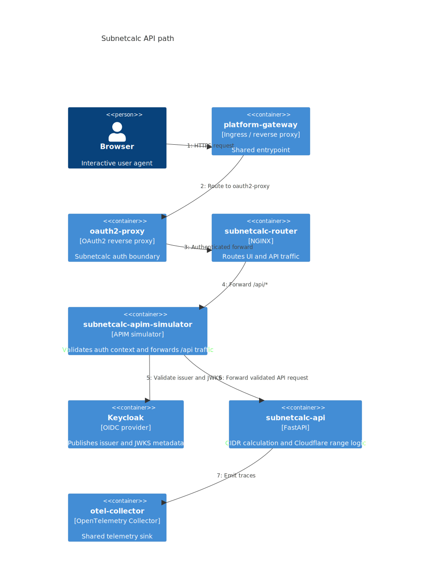](./diagrams/apps-c4/06-dynamic-subnetcalc-api-path.mmd)

Control points:

- `platform-gateway-hardened`, `sso-hardened`, and `subnetcalc-router-ingress`
  control entry into `subnetcalc`.
- `subnetcalc-router-http-routes` constrains the router to APIM hop and its
  allowed HTTP methods and paths.
- `apim-baseline` plus `subnetcalc-api-http-routes` constrain the APIM to API
  hop.

### Subnetcalc Range Source Split

[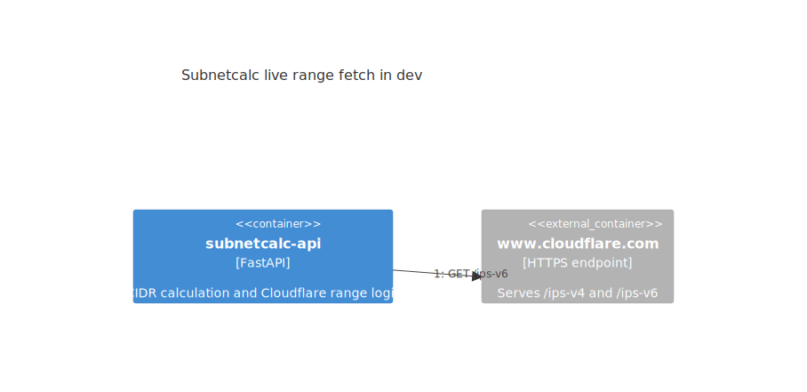](./diagrams/apps-c4/07-dynamic-subnetcalc-range-source-split.mmd)

Control points:

- `subnetcalc-cloudflare-live-fetch` allows the `dev` live fetch path as a
  namespace-local override.
- `uat` has no equivalent allow, so the application falls back in
  `cloudflare_ips.py`.

### Sentiment API Path

[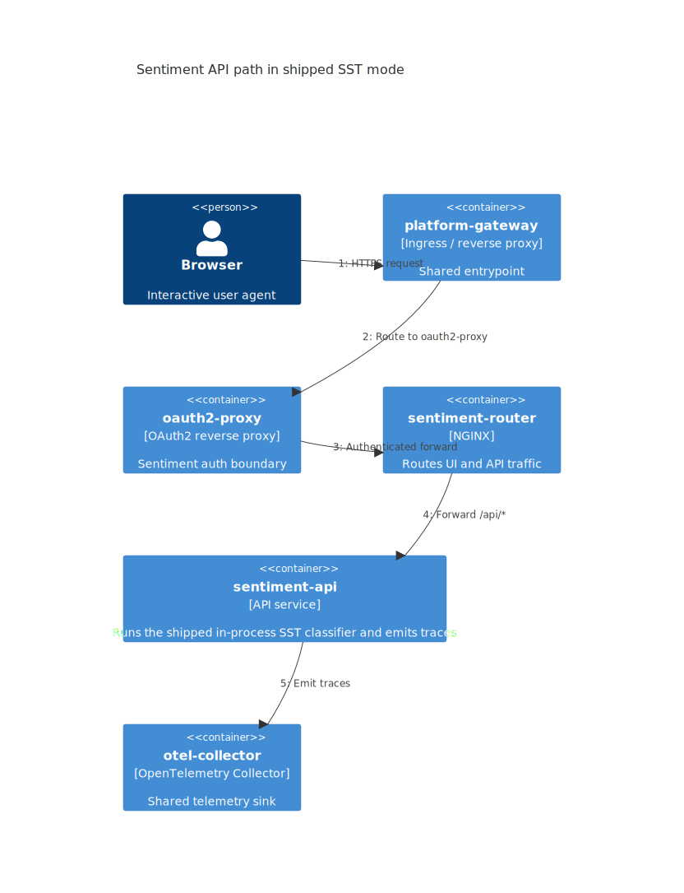](./diagrams/apps-c4/08-dynamic-sentiment-api-path.mmd)

Control points:

- `platform-gateway-hardened`, `sso-hardened`, and `sentiment-router-ingress`
  control entry into `sentiment`.
- `sentiment-router-http-routes` plus `sentiment-backend-ingress` constrain the
  router to API hop.
- the shipped default keeps inference inside `sentiment-api`; the only steady
  state network egress from the request path is trace export.

## Journey Views

### Subnetcalc Request Journey

[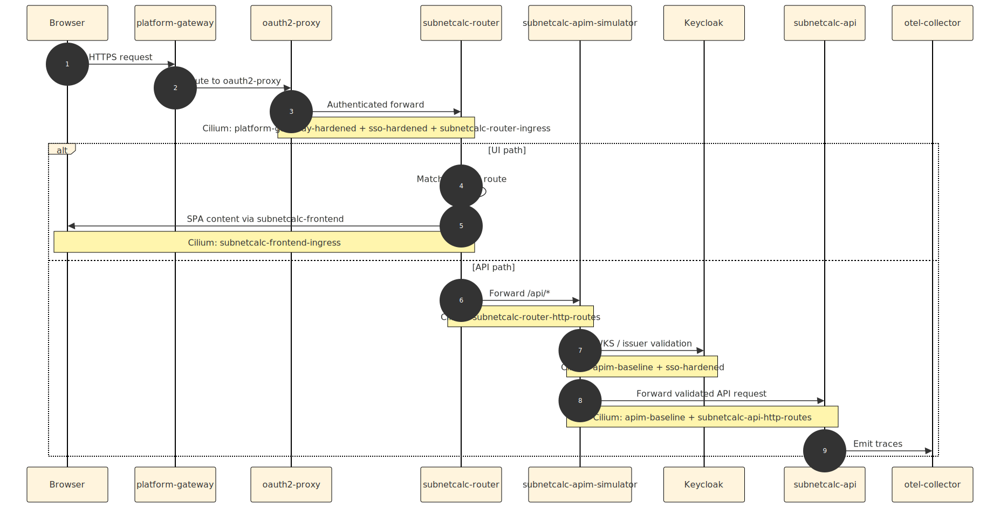](./diagrams/apps-c4/10-journey-subnetcalc-request.mmd)

### Subnetcalc Live Range Refresh

[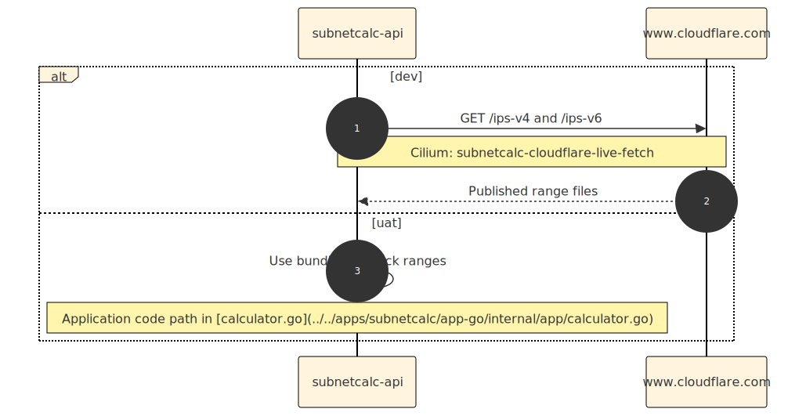](./diagrams/apps-c4/11-journey-subnetcalc-live-range-refresh.mmd)

### Subnetcalc Auth Handshake And Logout

[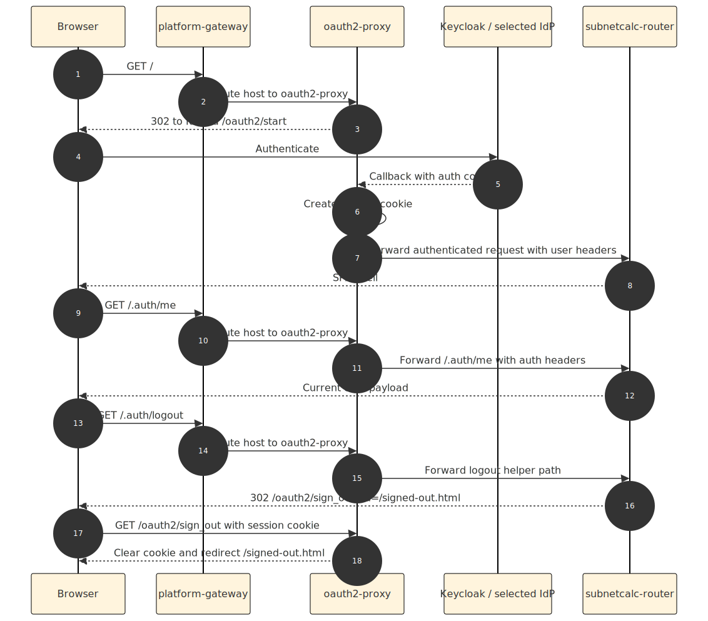](./diagrams/apps-c4/12-journey-subnetcalc-auth-handshake-logout.mmd)

### Sentiment Request Journey

[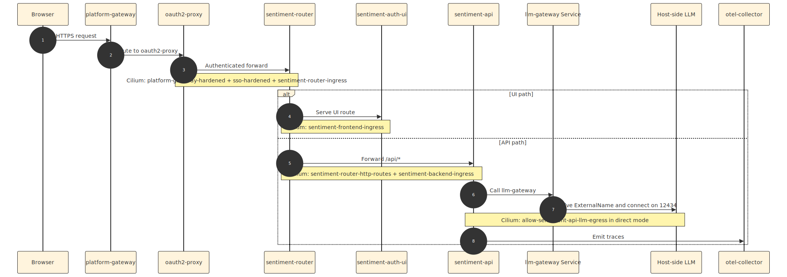](./diagrams/apps-c4/13-journey-sentiment-request.mmd)

## Policy Control Matrix

| Hop | Runtime owner | Main control point | Notes |
| --- | --- | --- | --- |
| `platform-gateway -> oauth2-proxy` | Gateway routing and SSO | `platform-gateway-hardened` and `sso-hardened` | Shared platform boundary for both apps. |
| `oauth2-proxy -> subnetcalc-router` | Authenticated reverse proxy | `sso-hardened` plus `subnetcalc-router-ingress` | Only SSO pods should reach the router. |
| `subnetcalc-router -> subnetcalc-frontend` | Router UI path | `subnetcalc-frontend-ingress` | The router stays the only frontend caller. |
| `subnetcalc-router -> subnetcalc-apim-simulator` | Router API path | `subnetcalc-router-http-routes` | L7 policy constrains methods and paths. |
| `subnetcalc-apim-simulator -> subnetcalc-api` | Token-checked API forwarding | `apim-baseline` plus `subnetcalc-api-http-routes` | APIM is the only allowed backend caller. |
| `subnetcalc-api -> www.cloudflare.com` | Background range refresh | `subnetcalc-cloudflare-live-fetch` in `dev`; no matching allow in `uat` or `sit` | `dev` uses live fetch, `uat` and `sit` use fallback in code. |
| `oauth2-proxy -> sentiment-router` | Authenticated reverse proxy | `sso-hardened` plus `sentiment-router-ingress` | Mirrors the subnetcalc entry path. |
| `sentiment-router -> sentiment-auth-ui` | Router UI path | `sentiment-frontend-ingress` | Frontend is isolated behind the router. |
| `sentiment-router -> sentiment-api` | Router API path | `sentiment-router-http-routes` plus `sentiment-backend-ingress` | UI and API stay separate. |
| `sentiment-api -> in-process SST classifier` | Sentiment inference | `sentiment-api` application code and workload config | No inference network hop in the shipped runtime. |
| `sentiment-api -> otel-collector` | Trace export | `sentiment-api-egress` | Observability remains part of the application path even when inference stays local to the pod. |
| `subnetcalc-api -> otel-collector` | Trace export | `subnetcalc-api-http-routes` | Observability is part of the application path, not an afterthought. |

## Policy Layering Cheatsheet

- `shared/` holds clusterwide baselines, application guardrails, and platform
  boundaries.
- `projects/` holds reusable namespaced app-flow bundles such as
  `sentiment/` and `subnetcalc/`.
- `dev/`, `uat/`, and `sit/` are thin namespace overlays that apply those
  reusable bundles, and `*/overrides/` is the namespace-local extension point
  for exceptions like the dev-only Cloudflare live fetch.
- Cilium is additive, so the useful mental model is:
  1. shared platform, DNS, and application guardrails
  2. reusable project bundles rendered into an application namespace
  3. namespace-local overrides where a team needs a deliberate exception
- The composition of those layers is easier to inspect through
  `terraform/kubernetes/scripts/show-policy-composition.sh` and the generated
  `cluster-policies/COMPOSITION.md` view than by reading filenames alone.
